# Measurements

Every number in this document was measured on 2026-09-23 on the master line
of this work: the series of the pull request on master `c941fbc399`, plus the
two independent commits under it. The release-1.13 line had its own set of
numbers; they are gone from this document, and the last section says where
the two lines differ.

Every number comes from a data file under [`results/data/`](results/data),
one directory per build: [`e1`](results/data/e1), [`checked`](results/data/checked),
[`trusted`](results/data/trusted), [`probe`](results/data/probe).
[`results/tables.py`](results/tables.py) writes every table below from those
files, a marker naming the directory it reads, and
[`results/plot.py`](results/plot.py) draws the plots under
[`results/plots/`](results/plots) from them, one directory per build too.
[`results/run_all.sh`](results/run_all.sh) runs the rows and writes the data,
with `JULIA`, `VANILLA`, `BASELINE_BIN` and `DATA` naming the builds and the
directory of a run; the logs go to `results/log/`, which git ignores. A number
in the prose repeats a number of a table.

## The five builds

| name | tree | flags | what it is |
| --- | --- | --- | --- |
| `master` | upstream master `c941fbc399` | none | stock Julia of that day |
| `base` | master plus the two independent commits | none | the deferral fix and `jl_gc_heap_reserve`; the pull request's flag-less build compiles to this code |
| `checked` | the whole series | `WITH_GC_REGIONS=1` | the regions with their escape barrier: the default of the flag |
| `trusted` | the whole series | `WITH_GC_REGIONS=1 WITH_GC_REGION_BARRIER=0` | the regions without the barrier, for a program validated with it on |
| `probe` | the whole series | `WITH_GC_REGIONS=1 -DJL_NO_REGION_ALLOC` | the regions compiled but unusable: the allocator on the stock pools, the census filter folded, every window refused; a probe of what the rest of the region code costs, not a build anyone uses |

Each is installed with `make install` under `/var/tmp/gc-regions-evidence/`,
and [`results/text_sizes.sh`](results/text_sizes.sh) records the text of the
runtime library and of the system image of each.

## How a row is measured

A **cost row** is paired. One round runs each binary once, and the order of
the binaries turns over between the rounds, so a drift of the machine moves
both sides of a round together. The cell of a binary is the median of its
rounds. The cell of a comparison is the median of the per-round differences
or ratios, with a percentile bootstrap interval at 95 % beside it and, for a
difference, the p value of the sign test: the question ten rounds can answer
is whether the difference keeps its direction.
[`results/stats.py`](results/stats.py) computes all of it, seeded. The
latency rows are not paired and not averaged: a tail is a maximum and a set
of quantiles, and the document reports them as such.

The machine: one Linux x86-64 host of 32 CPUs and 61 GB, one NUMA node,
transparent huge pages `always`, idle for the whole run. The kernel command
line keeps CPUs 13 and 29, the two threads of one core, tickless and free of
RCU callbacks (`nohz_full=13,29`); [`tools/hil_isolation.sh`](tools/hil_isolation.sh)
made the isolated partition at run time through cgroup v2 (`sudo ... on`).
The **latency rows** (M3, M4, M5, M6, and the paced and tail rows with the
reserve) ran inside the partition, pinned to CPU 29 in the real-time class
(`SCHED_FIFO` 50), the driver beside them in the normal class; the tick left
the core (211 interrupts a second against 2,000 outside the partition), and a
pure spin of five seconds there has a worst gap of 2.1 µs. Every other row
ran outside the partition, the one-thread rows pinned to CPU 28, the
multi-thread rows on CPUs 24 to 28, 30 and 31, and the collector rows M13
and M14 on the 30 CPUs outside the partition, so their largest thread count
is 30 where the release-1.13 line had 32. Every row ran under a timeout and
under a memory cap: a systemd scope outside the partition, the partition's
own cgroup limit of 16 GB inside it. `data/<run>/context.tsv` records the
date, the commit, the host, the CPU, the kernel and the cores of each run.

## E1 — The two independent commits

The first two commits of the series are stock-collector changes that the
measured loops need, and they are measured on their own: `master` against
`base`, the build that differs from it by those two commits alone.

**The deferral fix.** With the collector disabled and the heap past its
target, master enters the collection entry at every allocation and defers
there; base raises the target once and returns to the fast path.
[`bench/deferral.jl`](bench/deferral.jl) allocates a million small objects
per block with the collector disabled, sixty blocks, and reports the median
nanoseconds per allocation over the second half; both builds defer 480 MB
in every run.

<!-- table E1-deferral run=e1 -->
|  | master | base (the fix) | base / master [95 %] | rounds |
| --- | --- | --- | --- | --- |
| ns per allocation, past the target | 9.65 [9.54, 9.82] | 4.29 [4.26, 4.46] | 0.446 [0.437, 0.458] | 10 |
<!-- /table -->

**The heap reserve.** `jl_gc_heap_reserve(bytes)` maps and prefaults pool
pages before a loop. On the stock paced loop (the collector on, a 128 MB
heap hint) it takes the faults of the run from 1,736 to 1,263 and leaves
the misses where they are, because the stock collector gives pages back
between collections and faults them in again; the reserve is for a loop
that keeps its pages, which is the region loop of M6. Master has no reserve
and shows the same faults as base without one.

<!-- table E1-reserve run=e1 -->
| run | page faults during the run | slot misses | worst lateness (ms) | longest event (µs) |
| --- | --- | --- | --- | --- |
| base, no reserve | 1,736 | 62 | 4.8 | 4,754 |
| base, 512 MB reserved | 1,263 | 55 | 4.9 | 4,890 |
| master, no reserve | 1,760 | 57 | 4.9 | 4,871 |
<!-- /table -->

## E2 — The cost when the regions are built and unused

**Claim.** A program that never opens a window pays, with the barrier
built, one load and one branch at every managed pointer store, a longer
allocation path, the census filter in the mark, and a larger system image;
without the barrier the store costs nothing and the image grows a third of
that. The `probe` build, which keeps the region code but takes the allocator
and the filter out, says which part of the rest costs what.

**Text.** The system image grows 8.9 % with the barrier built and 2.7 %
without it; the runtime library 2.1 % and 0.85 %. The barrier's guard sits
at every barrier site of the compiled code, and it is two thirds of the
growth.

<!-- table E2-text -->
| build | libjulia-internal text (bytes) | against base | sys.so text (bytes) | against base |
| --- | --- | --- | --- | --- |
| master | 2,752,678 | -0.05 % | 24,147,941 | +0.00 % |
| base | 2,753,991 | +0.00 % | 24,147,293 | +0.00 % |
| checked | 2,810,546 | +2.05 % | 26,288,113 | +8.87 % |
| trusted | 2,777,325 | +0.85 % | 24,806,545 | +2.73 % |
| probe | 2,808,538 | +1.98 % | 26,287,561 | +8.86 % |
<!-- /table -->

**The unit costs, attributed.** Each cell is the paired difference "the
region build with no window open minus base", from ten rounds of
[`bench/unit_costs.jl`](bench/unit_costs.jl) on each of the three region
builds. The store costs 0.045 ns with the barrier and nothing without it,
so the store's cost is the guard alone. A pool allocation costs 0.34 ns
with everything built, 0.26 without the barrier and 0.10 in the probe, so
the allocator path is about 0.17 ns and the region code around an
allocation the rest. The serial mark costs 0.9 to 1.1 ms of 65 with the
regions usable and nothing in the probe, so its cost is the census filter
in the claim.

<!-- table E2-unit-attribution -->
| cost | unit | regions built, barrier built − base | regions built, no barrier − base | regions built, allocator and filter off − base |
| --- | --- | --- | --- | --- |
| store_disarmed | ns/store | 0.0446 [0.0407, 0.054], sign 0.002 | 0.00035 [-0.0121, 0.0035], sign 1 | 0.0426 [0.0373, 0.0434], sign 0.002 |
| alloc_stock | ns/object | 0.343 [0.331, 0.353], sign 0.002 | 0.263 [0.257, 0.273], sign 0.002 | 0.098 [0.0815, 0.113], sign 0.002 |
| construct_two | ns/object | 0.678 [0.604, 0.775], sign 0.002 | 0.588 [0.559, 0.64], sign 0.002 | 0.208 [0.141, 0.281], sign 0.002 |
| box_twin | ns/object | 0.672 [0.636, 0.688], sign 0.002 | 0.402 [0.354, 0.433], sign 0.002 | 0.514 [0.462, 0.544], sign 0.002 |
| stock_mark | ms/collection | 0.895 [0.325, 1.31], sign 0.021 | 1.1 [0.69, 1.57], sign 0.002 | -0.045 [-0.19, 0.31], sign 0.75 |
<!-- /table -->

The full table of `checked`, with the rows of a program that uses regions
(the `regions` column) beside the two stock columns:

<!-- table M2 run=checked -->
| cost | unit | vanilla | regions, no window | regions | no window − vanilla [95 %] | rounds |
| --- | --- | --- | --- | --- | --- | --- |
| store_disarmed | ns/store | 0.3328 [0.3319, 0.3357] | 0.378 [0.3768, 0.3882] | 0.3756 [0.3738, 0.3788] | 0.0446 [0.0407, 0.054], sign 0.002 | 10 |
| store_armed | ns/store | — | — | 1.443 [1.443, 1.444] | — | 10 |
| store_region | ns/store | — | — | 2.034 [2.032, 2.036] | — | 10 |
| window_pair | ns/pair | — | — | 11.29 [11.29, 11.29] | — | 10 |
| switch_pair | ns/pair | — | — | 6.147 [5.942, 6.337] | — | 10 |
| construct_two | ns/object | 7.23 [7.167, 7.295] | 7.893 [7.831, 7.953] | 10.19 [10.16, 10.22] | 0.678 [0.604, 0.775], sign 0.002 | 10 |
| construct_shared | ns/object | 3.469 [3.45, 3.492] | 3.792 [3.762, 3.807] | 6.204 [6.189, 6.224] | 0.306 [0.282, 0.334], sign 0.002 | 10 |
| box_twin | ns/object | 3.785 [3.748, 3.802] | 4.447 [4.423, 4.492] | 6.129 [6.111, 6.158] | 0.672 [0.636, 0.688], sign 0.002 | 10 |
| alloc_stock | ns/object | 2.045 [2.03, 2.055] | 2.38 [2.377, 2.393] | 3.444 [3.414, 3.459] | 0.343 [0.331, 0.353], sign 0.002 | 10 |
| alloc_region | ns/object | — | — | 3.885 [3.878, 3.891] | — | 10 |
| reset_slice | ns/reset | — | — | 30 [30, 30] | — | 10 |
| stock_mark | ms/collection | 64.8 [64.19, 65.22] | 65.47 [65.15, 65.66] | 65.98 [65.26, 66.53] | 0.895 [0.325, 1.31], sign 0.021 | 10 |
<!-- /table -->

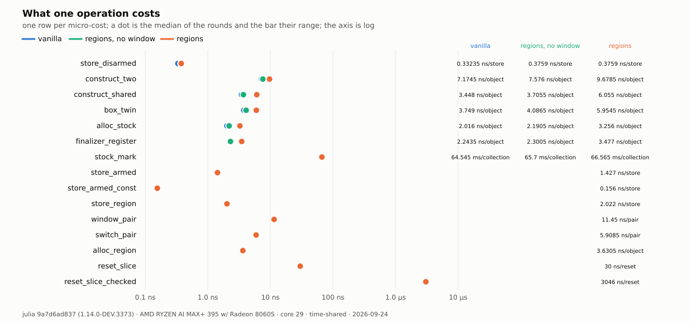

**The collector on the whole machine.** A full collection of the same
heap, regions against base, at 1 to 30 threads, ten paired rounds each
([`bench/parallel_gc.jl`](bench/parallel_gc.jl)). With the regions usable
the collection costs 1 % more at one thread and 8 to 9 % more at thirty,
with or without the barrier; the probe costs 3 % at thirty. So the growth
with the thread count is the census filter in the mark loop, 5 to 6 points
at thirty threads, and the collector's other checks, the corpse test at a
mark and the page test at a sweep, are the remaining 3.

<!-- table E2-parallel-attribution -->
| threads | regions built, barrier built / base [95 %] | regions built, no barrier / base [95 %] | regions built, allocator and filter off / base [95 %] |
| --- | --- | --- | --- |
| 1 | 1.01 [0.996, 1.02] | 1.01 [1, 1.02] | 0.991 [0.983, 1] |
| 4 | 1.02 [1.01, 1.02] | 1.02 [1.02, 1.02] | 0.992 [0.985, 0.999] |
| 8 | 1.02 [1, 1.05] | 1.03 [0.981, 1.05] | 1.01 [1, 1.05] |
| 16 | 1.05 [1.04, 1.08] | 1.03 [0.999, 1.11] | 1.02 [0.987, 1.03] |
| 30 | 1.08 [1.05, 1.11] | 1.09 [1.05, 1.11] | 1.03 [1.02, 1.06] |
<!-- /table -->

<!-- table M13 run=checked -->
| threads | vanilla (ms) | regions (ms) | regions / vanilla [95 %] | mark vanilla (ms) | mark regions (ms) | time to safepoint (µs) | rounds |
| --- | --- | --- | --- | --- | --- | --- | --- |
| 1 | 40.2 [39.4, 40.9] | 40.4 [40.1, 41.1] | 1.01 [0.996, 1.02] | 36.1 [35.4, 36.6] | 36.4 [36.2, 36.8] | 4.13 [3.42, 4.86] | 10 |
| 4 | 56.4 [56.2, 56.7] | 57.4 [57.3, 57.6] | 1.02 [1.01, 1.02] | 48.8 [48.7, 49] | 49.6 [49.5, 49.7] | 6.91 [5.99, 7.38] | 10 |
| 8 | 58.9 [57.9, 59.7] | 60.1 [58.8, 61.4] | 1.02 [1, 1.05] | 48.8 [48, 49.9] | 49.4 [48.5, 51.3] | 7.69 [7.42, 8.09] | 10 |
| 16 | 65.7 [64.2, 66.5] | 68.7 [68.1, 70] | 1.05 [1.04, 1.08] | 49.6 [48.3, 50.5] | 51.9 [51.3, 53.1] | 7.76 [7.52, 8.44] | 10 |
| 30 | 79.5 [78.1, 80.7] | 85.6 [83.9, 87.7] | 1.08 [1.05, 1.11] | 55.5 [54.7, 56.9] | 60.5 [59.3, 62.3] | 8.22 [7.93, 8.5] | 10 |
<!-- /table -->

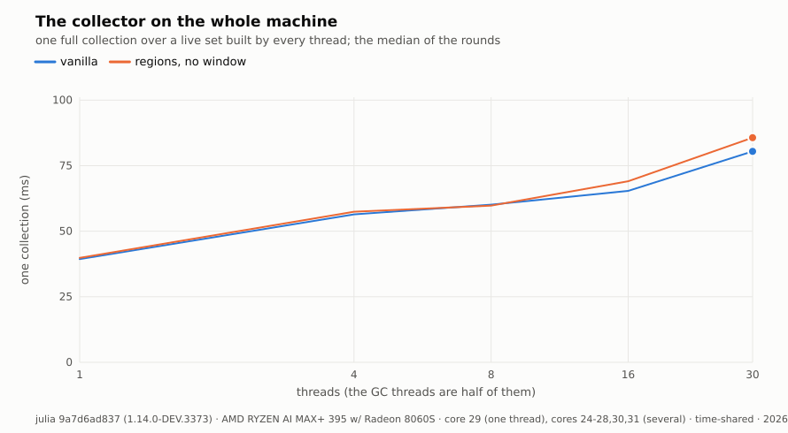

**The GC benchmark suite.** Eleven benchmarks of
[GCBenchmarks](https://github.com/JuliaCI/GCBenchmarks), six on one thread
and five on four, ten paired rounds, base against each region build; the
cell is the ratio of the minima over the rounds
([`bench/gcbench.sh`](bench/gcbench.sh)).

<!-- table M1 run=checked -->
| benchmark | threads | vanilla (s) | regions (s) | regions / vanilla [95 %] | rounds |
| --- | --- | --- | --- | --- | --- |
| append | 1 | 0.829 | 0.785 | 0.949 [0.899, 0.998] | 2 |
| tree | 1 | 9.037 | 9.035 | 1 [0.987, 1.02] | 4 |
| strings | 1 | 19.013 | 18.809 | 1 [0.961, 1.01] | 4 |
| pollard | 1 | 0.667 | 0.698 | 1.05 [1.04, 1.06] | 4 |
| single_ref | 1 | 0.276 | 0.275 | 0.999 [0.99, 1.01] | 4 |
| many_refs | 1 | 1.746 | 1.796 | 1.03 [1.03, 1.03] | 4 |
| mergesort_parallel | 4 | 1.732 | 1.710 | 0.994 [0.957, 1.01] | 4 |
| mm_divide_and_conquer | 4 | 0.602 | 0.605 | 1.01 [1, 1.01] | 4 |
| issue-52937 | 4 | 9.470 | 9.552 | 1.01 [1, 1.01] | 4 |
<!-- /table -->

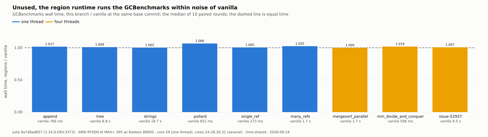

<!-- table M1 run=trusted -->
<!-- /table -->

<!-- table M1 run=probe -->
<!-- /table -->

## E3 — What a program that uses regions pays

**Claim.** In a window, a store costs the tag compare when the barrier is
armed; a region allocation, a window pair and an unchecked reset cost a few
nanoseconds; a checked reset costs the stop of the world, and so grows with
the threads that run Julia code.

From the `regions` column of the unit costs above, on `checked`: a managed
store 1.44 ns armed against 0.38 disarmed; a region allocation 3.9 ns
against 3.4 for a stock one in the same process; a window pair 11.3 ns, a
task switch pair 6.1; an unchecked reset 30 ns whatever the region held; a
checked reset 27 µs on one thread. On `trusted` the same store costs
0.33 ns and a region allocation 2.2 ns, less than a stock allocation there.

**The reset against the other threads.** [`bench/reset_pause.jl`](bench/reset_pause.jl)
resets a small region two hundred times while the other threads run Julia
code, at 1 to 30 threads, ten rounds. The checked reset grows from 27 µs
alone to 105 µs against 29 workers, and its worst case at 30 threads is
3.8 ms, with a worker stalled up to 4.4 ms; the unchecked reset stays
between 65 and 130 ns. The worst worker stall of the unchecked row at 30
threads is the scheduler's, not a pause: 30 threads and their collector
threads share 30 CPUs there.

<!-- table M14 run=checked -->
| entry | threads | workers | caller median (µs) | caller max (µs) | worst worker stall (µs) | collections | rounds |
| --- | --- | --- | --- | --- | --- | --- | --- |
| checked | 1 | 0 | 26.9 [26.8, 27.3] | 37.8 [34.3, 44.1] | — | 0 | 10 |
| checked | 4 | 3 | 35.5 [35.2, 36.1] | 235 [165, 415] | 119 [90.8, 166] | 0 | 10 |
| checked | 8 | 7 | 44 [42.7, 45] | 131 [110, 300] | 109 [99.8, 404] | 1 | 10 |
| checked | 16 | 15 | 68.8 [66.6, 70.5] | 460 [405, 700] | 227 [163, 669] | 0 | 10 |
| checked | 30 | 29 | 105 [103, 107] | 3.81e+03 [3.52e+03, 3.86e+03] | 4.37e+03 [3.62e+03, 5.22e+03] | 0 | 10 |
| unsafe | 1 | 0 | 0.0653 [0.06, 0.075] | 0.17 [0.12, 0.3] | — | 0 | 10 |
| unsafe | 4 | 3 | 0.07 [0.06, 0.08] | 0.19 [0.166, 0.271] | 0 [0, 21.9] | 0 | 10 |
| unsafe | 8 | 7 | 0.0705 [0.07, 0.08] | 0.341 [0.255, 0.982] | 11.4 [0, 978] | 1 | 10 |
| unsafe | 16 | 15 | 0.09 [0.08, 0.09] | 1.81 [0.376, 2.21] | 0 [0, 14.9] | 0 | 10 |
| unsafe | 30 | 29 | 0.13 [0.115, 0.135] | 0.451 [0.211, 1.17] | 4e+03 [2.48e+03, 4.5e+03] | 0 | 10 |
<!-- /table -->

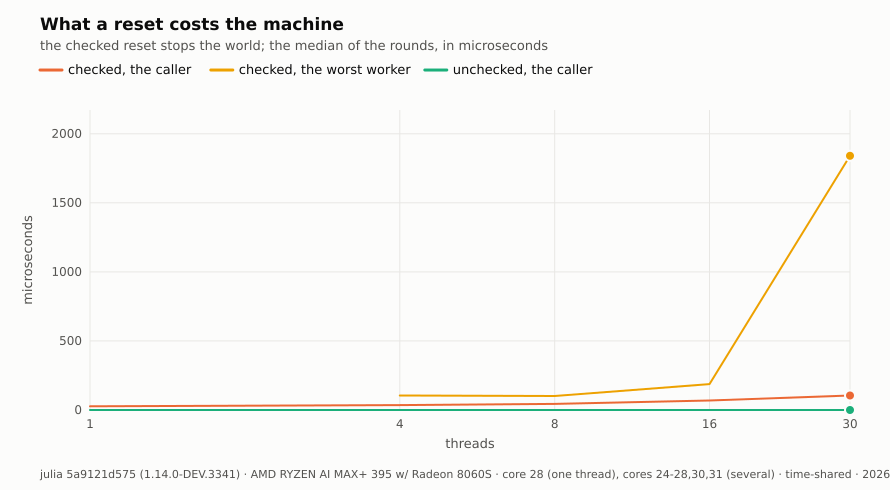

## E4 — What the regions buy

Every loop below ran twice, on `checked` and on `trusted`; the baseline
and stock rows ran on `base`. The loops use the unchecked reset, which is
the reset of a loop that has shown it leaves no reference behind; M14 above
says what the checked one would add.

### M3 — The tail

**Claim.** In a pooled event loop whose only garbage is the scratch of the
sink, the reset of the Event region after each event removes the collector
from the per-event latency.

[`bench/tail.jl`](bench/tail.jl) runs twenty million events; `baseline` is
the allocating model under the stock collector, `regions` the scratch model
with one unchecked reset per event; [`bench/yardstick.jl`](bench/yardstick.jl)
gives the two ends, an allocating loop and a loop with every allocation
removed by hand. With 512 MB reserved, on the isolated core:

<!-- table M3 run=checked -->
| script | variant | p50 (ns) | p99 (ns) | p99.9 (ns) | p99.99 (ns) | max (ns) | over 100 µs | collections | GC (ms) | peak RSS (MB) |
| --- | --- | --- | --- | --- | --- | --- | --- | --- | --- | --- |
| yardstick | alloc | 61 | 81 | 250 | 841 | 5,738,505 | 20 | 11 | 14.7 | 905 |
| yardstick | pooled | 60 | 80 | 90 | 582 | 94,378 | 0 | 0 | 0.0 | 822 |
| tail | baseline | 60 | 80 | 200 | 521 | 4,295,833 | 16 | 16 | 17.8 | 1,425 |
| tail | regions | 70 | 111 | 111 | 551 | 104,888 | 1 | 0 | 0.0 | 1,562 |
<!-- /table -->

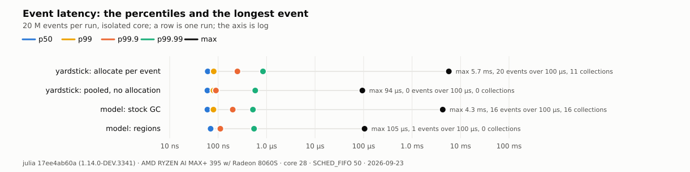

<!-- table M3 run=trusted -->
| script | variant | p50 (ns) | p99 (ns) | p99.9 (ns) | p99.99 (ns) | max (ns) | over 100 µs | collections | GC (ms) | peak RSS (MB) |
| --- | --- | --- | --- | --- | --- | --- | --- | --- | --- | --- |
| yardstick | alloc | 61 | 81 | 250 | 852 | 5,782,238 | 20 | 11 | 15.0 | 905 |
| yardstick | pooled | 70 | 81 | 91 | 742 | 92,575 | 0 | 0 | 0.0 | 822 |
| tail | baseline | 60 | 80 | 190 | 451 | 4,302,536 | 15 | 15 | 16.9 | 1,399 |
| tail | regions | 80 | 111 | 121 | 561 | 90,401 | 0 | 0 | 0.0 | 1,562 |
<!-- /table -->

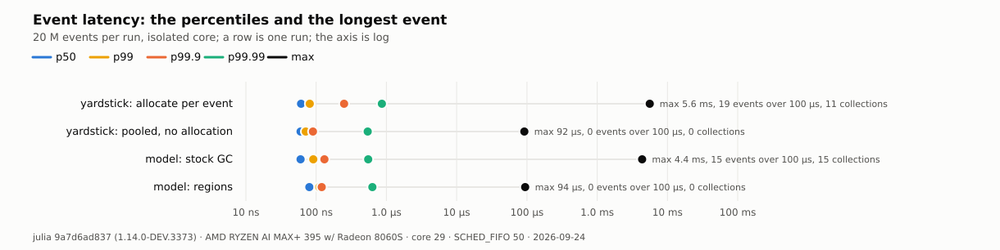

The stock loop's longest event is 4.2 ms, a collection; the region loop's
is 91 µs on `checked` and 90 on `trusted`, and so is the pooled yardstick's,
which allocates nothing. That maximum is not the runtime's: a bare loop of
ten million rounds of a window, a hundred allocations and an unchecked
reset has a worst round of 3.5 µs on the same core, and the paced loop and
the real-world matrix below stay under 15 µs. It is the benchmark's own
event queue, a `Vector` popped at the front and pushed at the back, whose
buffer moves through stock-heap pages the collector had given back before
the run; with transparent huge pages `always`, the first touch of such a
range zeroes 2 MB. The fault count of the row says so, 936 faults with the
reserve and without it, the same in the stock baseline.

### M4 — The real-world matrix

**Claim.** In an event loop that allocates per event, one window per slice
and one reset per slice, with a census at the slice boundary, give a lower
and flatter latency distribution than the stock collector, under its own
heuristics or under the program's schedule.

[`results/realworld.sh`](results/realworld.sh) runs five million events at
two garbage weights, W=200 words (a recording) and W=3, with the heap
reserved and prefaulted, memory locked, pinned and real-time on the isolated
core; it counts the page faults and the involuntary switches of the run,
and keeps the try with the fewest. Every configuration reads 0 faults and 0
switches. On `checked`:

<!-- table M4 run=checked -->
| class | mode | events/s | p50 (ns) | p99 (ns) | p99.99 (ns) | max (ns) | max, no preemption (ns) | stock collections | peak RSS (MB) |
| --- | --- | --- | --- | --- | --- | --- | --- | --- | --- |
| recording, W=200 | stock, own heuristics | 6.5 M | 81 | 391 | 762 | 3,348,376 | 3,348,376 | 325 | 1,657 |
| recording, W=200 | stock, program schedule | 6.6 M | 71 | 381 | 932 | 3,173,476 | 3,173,476 | 366 | 1,657 |
| recording, W=200 | regions, census | 14.0 M | 50 | 80 | 171 | 56,346 | 56,346 | — | 1,618 |
| recording, W=200 | regions, no census | 14.4 M | 50 | 80 | 291 | 15,139 | 15,139 | — | 1,618 |
| light, W=3 | stock, own heuristics | 16.7 M | 40 | 50 | 241 | 3,640,437 | 3,640,437 | 37 | 1,674 |
| light, W=3 | stock, program schedule | 16.4 M | 40 | 50 | 171 | 3,078,267 | 3,078,267 | 51 | 1,657 |
| light, W=3 | regions, census | 16.0 M | 40 | 51 | 120 | 52,219 | 52,219 | — | 1,618 |
| light, W=3 | regions, no census | 16.2 M | 40 | 51 | 270 | 12,553 | 12,553 | — | 1,618 |
<!-- /table -->

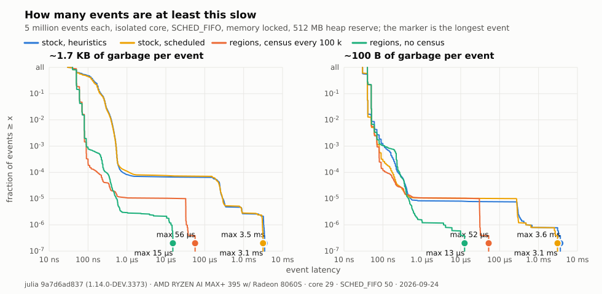

The stock collector's longest event is 3.3 to 3.7 ms; the regions' is 50 µs
with the census, exactly at a census boundary, and 10 to 14.5 µs without it.

### M6 — Paced and endurance

**Claim.** At one event per 100 µs on the wall clock, the region loop
misses no slot, where the stock loop misses a slot at every collection;
over 30 minutes the RSS of the region loop stays flat.

[`bench/paced.jl`](bench/paced.jl) fires a million events, one per 100 µs
slot; the row reports how late an event completes against its slot start,
and the page faults of the run. The last row of each table is the region
loop with 512 MB reserved.

<!-- table M6-paced run=checked -->
| variant | events | latency p50 (ns) | latency max (ns) | lateness p99.9 (ns) | lateness max (ns) | slot misses | GC events | GC (ms) |
| --- | --- | --- | --- | --- | --- | --- | --- | --- |
| baseline | 1,000,000 | 80 | 4,674,588 | 686 | 4,674,637 | 52 | 1 | 4.6 |
| regions | 1,000,000 | 90 | 6,783 | 250 | 47,481 | 0 | 0 | 0.0 |
| regions | 1,000,000 | 100 | 8,286 | 343 | 8,570 | 0 | 0 | 0.0 |
<!-- /table -->

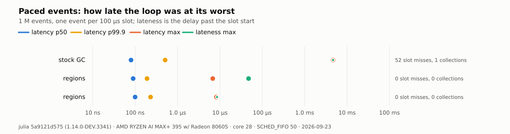

<!-- table M6-paced run=trusted -->
| variant | events | latency p50 (ns) | latency max (ns) | lateness p99.9 (ns) | lateness max (ns) | slot misses | GC events | GC (ms) |
| --- | --- | --- | --- | --- | --- | --- | --- | --- |
| baseline | 1,000,000 | 70 | 4,951,299 | 692 | 4,951,348 | 56 | 1 | 4.9 |
| regions | 1,000,000 | 90 | 6,241 | 255 | 8,620 | 0 | 0 | 0.0 |
| regions | 1,000,000 | 81 | 5,491 | 797 | 66,921 | 0 | 0 | 0.0 |
<!-- /table -->

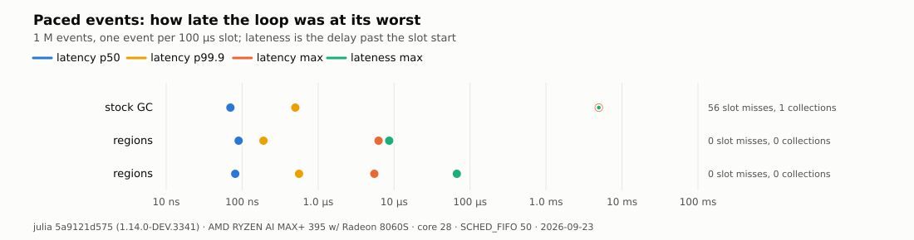

The stock loop completes an event 4.7 to 5.0 ms late at worst and misses 52
to 56 slots of a million; the region loop completes every event within
6.8 µs on `checked` and 6.2 µs on `trusted` and misses none.

[`bench/endurance.jl`](bench/endurance.jl) runs eighteen million events
over thirty minutes with one sample per hundred thousand:

<!-- table M6-endurance run=checked -->
| endurance | value |
| --- | --- |
| samples (one per 100 000 events) | 180 |
| events | 18,000,000 |
| wall (s) | 1,800 |
| RSS at the first sample (MB) | 333.46 |
| RSS at the last sample (MB) | 333.46 |
| RSS max (MB) | 333.46 |
| allocated through the region, first to last sample (MB) | 525 |
| slot misses | 0 |
<!-- /table -->

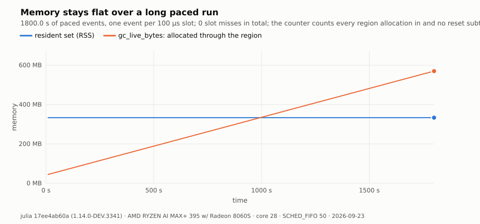

The RSS is 333 MB at the first sample and at the last, on both builds, with
525 MB allocated through the region between them.

### M7 — Against the C++ program

**Claim.** A model written for regions, a packet allocated at send and
dropped at delivery, runs within a small factor of the same model in C++
with `new` and `delete` per event, and the census keeps its memory flat.

[`bench/native.jl`](bench/native.jl) and [`bench/native.cpp`](bench/native.cpp),
five million events, a census every hundred thousand:

<!-- table M7 run=checked -->
| variant | W | events/s | censuses | census p50 (µs) | census max (µs) | peak RSS (MB) |
| --- | --- | --- | --- | --- | --- | --- |
| region | 3 | 59.0 M | 50 | 3.3 | 9.3 | 281.1 |
| stock | 3 | 60.1 M | — | — | — | 270.2 |
| cpp | 3 | 67.2 M | — | — | — | 3.9 |
| region | 200 | 31.1 M | 50 | 12.2 | 16.5 | 303.6 |
| stock | 200 | 25.7 M | — | — | — | 295.3 |
| cpp | 200 | 37.6 M | — | — | — | 3.8 |
<!-- /table -->

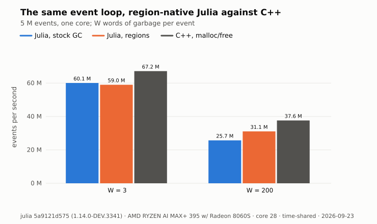

<!-- table M7 run=trusted -->
| variant | W | events/s | censuses | census p50 (µs) | census max (µs) | peak RSS (MB) |
| --- | --- | --- | --- | --- | --- | --- |
| region | 3 | 84.2 M | 50 | 3.1 | 8.6 | 280.1 |
| stock | 3 | 61.7 M | — | — | — | 270.1 |
| cpp | 3 | 69.3 M | — | — | — | 3.9 |
| region | 200 | 35.0 M | 50 | 10.8 | 15.8 | 303.7 |
| stock | 200 | 26.8 M | — | — | — | 269.8 |
| cpp | 200 | 35.6 M | — | — | — | 3.9 |
<!-- /table -->

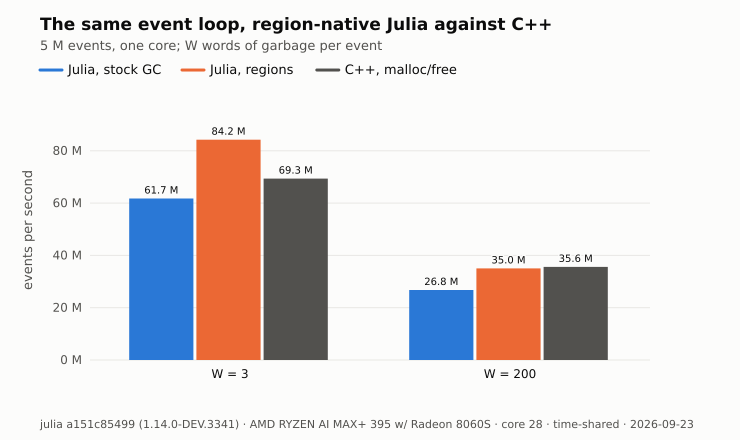

At the heavy weight the region loop runs at 0.83 of the C++ program on
`checked` and 0.98 on `trusted`, against 0.68 to 0.75 for the stock loop;
at the light weight `trusted` runs faster than the C++ program.

### M8 — Wholesale death

**Claim.** When a whole structure dies at once, a reset frees it without a
collection.

<!-- table M8 run=checked -->
| showcase | mode | wall (s) | collections | GC (ms) | peak RSS (MB) | rounds |
| --- | --- | --- | --- | --- | --- | --- |
| binarytree | stock | 0.377 | 31 | 81.5 | 266 | 3 |
| binarytree | regions | 0.341 | 0 | 0.0 | 266 | 3 |
| linkedlist | stock | 2.240 | 10 | 1711.4 | 2,404 | 3 |
| linkedlist | regions | 0.630 | 0 | 0.0 | 2,412 | 3 |
| tree | stock | 0.008 | 6 | 0.9 | — | 3 |
| tree | regions | 0.006 | 0 | 0.0 | — | 3 |
<!-- /table -->

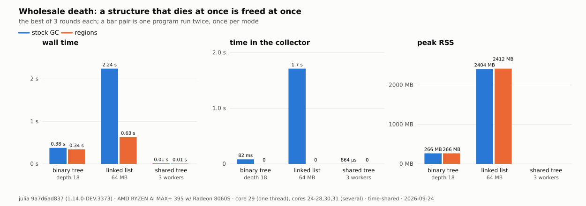

<!-- table M8 run=trusted -->
| showcase | mode | wall (s) | collections | GC (ms) | peak RSS (MB) | rounds |
| --- | --- | --- | --- | --- | --- | --- |
| binarytree | stock | 0.361 | 31 | 81.2 | 266 | 3 |
| binarytree | regions | 0.263 | 0 | 0.0 | 267 | 3 |
| linkedlist | stock | 2.234 | 10 | 1708.1 | 2,382 | 3 |
| linkedlist | regions | 0.532 | 0 | 0.0 | 2,391 | 3 |
| tree | stock | 0.007 | 6 | 0.8 | — | 3 |
| tree | regions | 0.004 | 0 | 0.0 | — | 3 |
<!-- /table -->

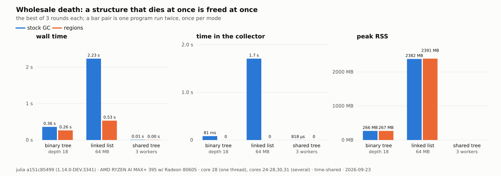

The linked list, which the stock collector traces ten times for 1.7 s,
runs in 0.63 s on `checked` and 0.53 s on `trusted` with no collection, at
the same peak RSS.

### M9 — The growth bound

**Claim.** The census of the open region, armed at a page threshold, holds
the pages of a region that churns inside one window to a bound; disarmed,
the region grows with the churn.

<!-- table M9 run=checked -->
| census | rounds | pages at the last round | pages max | ratio disarmed / armed |
| --- | --- | --- | --- | --- |
| disarmed | 40,000 | 10,089 | 10,089 | 1.00 |
| armed | 40,000 | 60 | 63 | 160.14 |
<!-- /table -->

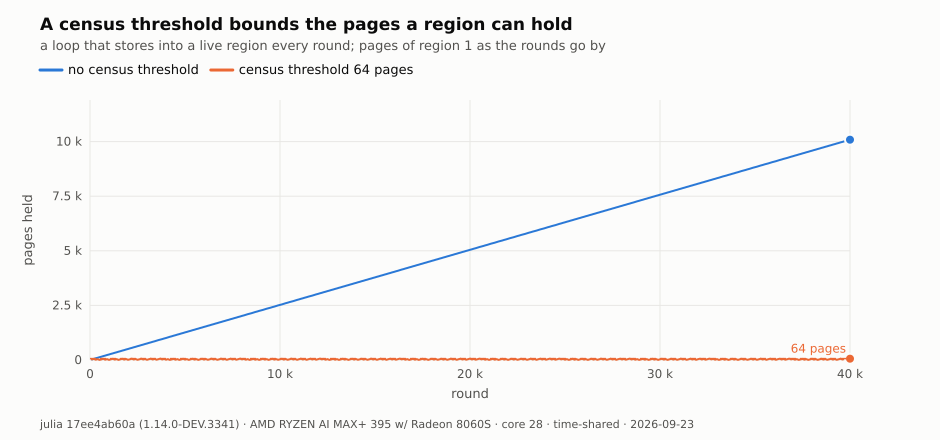

### M12 — Thread scaling of the sibling leaves

**Claim.** Sibling leaves, one per worker, scale with the thread count
without coordination between the leaves.

<!-- table M12 run=checked -->
| demo | point | threads | wall stock (ms) | wall regions (ms) | stock / regions | collections stock | collections regions | GC stock (ms) | GC regions (ms) |
| --- | --- | --- | --- | --- | --- | --- | --- | --- | --- |
| B | small | 1 | 13.2 | 13.4 | 0.98 | 0 | 0 | 0.0 | 0.0 |
| B | medium | 1 | 38.9 | 38.6 | 1.01 | 2 | 0 | 0.3 | 0.0 |
| B | large | 1 | 103.0 | 101.8 | 1.01 | 7 | 0 | 0.9 | 0.0 |
| D | work=0 | 1 | 97.1 | 95.0 | 1.02 | 0 | 0 | 0.0 | 0.0 |
| D | work=512 | 1 | 105.2 | 97.8 | 1.08 | 2 | 0 | 2.3 | 0.0 |
| D | work=2048 | 1 | 96.2 | 101.1 | 0.95 | 14 | 0 | 5.5 | 0.0 |
| B | small | 2 | 10.9 | 10.8 | 1.00 | 1 | 0 | 0.1 | 0.0 |
| B | medium | 2 | 30.6 | 30.6 | 1.00 | 3 | 0 | 0.3 | 0.0 |
| B | large | 2 | 81.0 | 79.1 | 1.02 | 8 | 0 | 0.8 | 0.0 |
| D | work=0 | 2 | 61.5 | 60.1 | 1.02 | 0 | 0 | 0.0 | 0.0 |
| D | work=512 | 2 | 60.0 | 61.7 | 0.97 | 3 | 0 | 2.7 | 0.0 |
| D | work=2048 | 2 | 71.4 | 61.4 | 1.16 | 17 | 0 | 8.0 | 0.0 |
| B | small | 4 | 5.7 | 6.2 | 0.92 | 1 | 0 | 0.1 | 0.0 |
| B | medium | 4 | 16.7 | 16.6 | 1.01 | 3 | 0 | 0.4 | 0.0 |
| B | large | 4 | 44.3 | 43.1 | 1.03 | 8 | 0 | 0.9 | 0.0 |
| D | work=0 | 4 | 40.8 | 40.3 | 1.01 | 0 | 0 | 0.0 | 0.0 |
| D | work=512 | 4 | 41.9 | 40.9 | 1.02 | 4 | 0 | 3.2 | 0.0 |
| D | work=2048 | 4 | 49.2 | 42.0 | 1.17 | 23 | 0 | 8.0 | 0.0 |
| B | small | 8 | 3.6 | 4.0 | 0.91 | 1 | 0 | 0.2 | 0.0 |
| B | medium | 8 | 10.4 | 10.3 | 1.00 | 3 | 0 | 0.4 | 0.0 |
| B | large | 8 | 27.1 | 26.1 | 1.04 | 8 | 0 | 1.1 | 0.0 |
| D | work=0 | 8 | 27.9 | 25.5 | 1.09 | 0 | 0 | 0.0 | 0.0 |
| D | work=512 | 8 | 27.2 | 26.1 | 1.04 | 4 | 0 | 2.1 | 0.0 |
| D | work=2048 | 8 | 40.2 | 27.2 | 1.48 | 24 | 0 | 8.2 | 0.0 |
<!-- /table -->

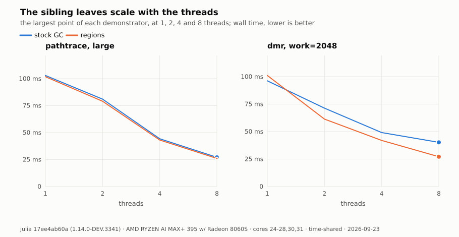

## E5 — The census, the demonstrators, the checker

### M5 — The census

**Claim.** The pause of a census grows with the live set of the region, not
with the garbage, and stays two orders of magnitude below a full stock
collection over the same heap.

[`bench/census.jl`](bench/census.jl), two million events, a census every
hundred thousand, K live records:

<!-- table M5-pause run=checked -->
| variant | K | pause p50 (µs) | pause max (µs) | stop the world (µs) | mark (µs) | sweep (µs) | live cells | freed cells |
| --- | --- | --- | --- | --- | --- | --- | --- | --- |
| scoped | 300 | 6.5 | 44.7 | 3.1 | 3.7 | 1.1 | 302 | 100,515 |
| coop | 300 | 2.9 | 20.1 | 0.1 | 2.9 | 1.3 | 302 | 100,515 |
| full | 300 | 2078.0 | 7104.8 | — | — | — | — | — |
| scoped | 1,000 | 7.7 | 47.2 | 2.7 | 4.8 | 1.3 | 1,002 | 100,550 |
| coop | 1,000 | 4.7 | 24.2 | 0.1 | 4.6 | 1.7 | 1,002 | 100,550 |
| full | 1,000 | 1881.5 | 5620.1 | — | — | — | — | — |
| scoped | 3,000 | 13.5 | 49.9 | 2.9 | 9.2 | 2.1 | 3,002 | 100,650 |
| coop | 3,000 | 10.6 | 27.3 | 0.1 | 9.4 | 2.1 | 3,002 | 100,650 |
| full | 3,000 | 2189.6 | 6579.6 | — | — | — | — | — |
| scoped | 10,000 | 34.2 | 77.3 | 3.4 | 27.1 | 4.9 | 10,002 | 101,000 |
| coop | 10,000 | 30.4 | 45.9 | 0.1 | 26.3 | 4.8 | 10,002 | 101,000 |
| full | 10,000 | 2391.6 | 6828.8 | — | — | — | — | — |
| scoped | 30,000 | 92.7 | 135.4 | 3.3 | 77.3 | 13.0 | 30,002 | 102,000 |
| coop | 30,000 | 88.6 | 109.7 | 0.1 | 76.6 | 12.9 | 30,002 | 102,000 |
| full | 30,000 | 3111.4 | 7841.0 | — | — | — | — | — |
| scoped | 100,000 | 301.1 | 429.8 | 3.3 | 263.6 | 46.8 | 100,002 | 105,500 |
| coop | 100,000 | 277.3 | 327.7 | 0.1 | 238.0 | 44.0 | 100,002 | 105,500 |
| full | 100,000 | 5413.0 | 10497.1 | — | — | — | — | — |
<!-- /table -->

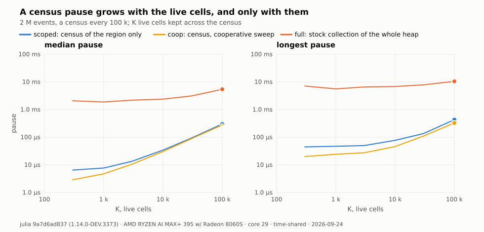

<!-- table M5-throughput run=checked -->
| variant | W | B | events/s | collections | peak RSS (MB) |
| --- | --- | --- | --- | --- | --- |
| autopool | 3 | 1 | 52.2 M | 0 | 1,049 |
| batch | 3 | 1 | 23.2 M | 0 | 1,049 |
| batch | 3 | 100 | 54.1 M | 0 | 1,049 |
| batch | 3 | 1000 | 54.5 M | 0 | 1,049 |
| pooled | 3 | 1 | 26.7 M | 50 | 1,049 |
| autopool | 200 | 1 | 10.9 M | 0 | 1,049 |
| batch | 200 | 1 | 20.1 M | 0 | 1,049 |
| batch | 200 | 100 | 39.4 M | 0 | 1,049 |
| batch | 200 | 1000 | 36.9 M | 0 | 1,049 |
| pooled | 200 | 1 | 22.8 M | 50 | 1,049 |
<!-- /table -->

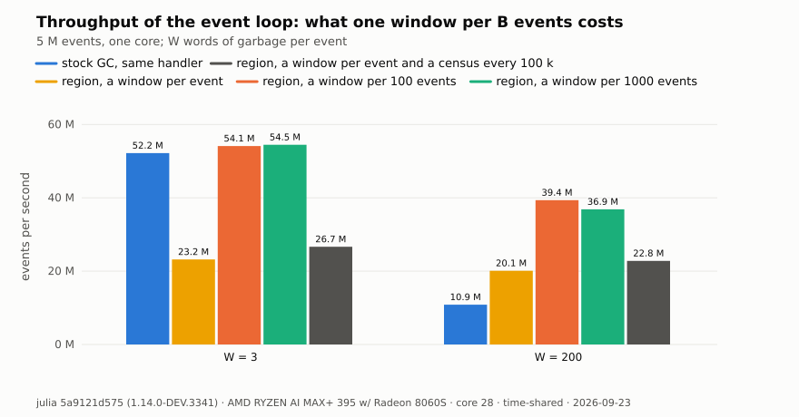

A census of a region with 300 live records pauses 6.5 µs at the median,
stop the world, and 2.9 µs cooperative; a full stock collection of the same
heap 2.1 ms. With 30,000 live records the census pauses 93 µs.

### M10 — The demonstrators

**Claim.** On four algorithms the same code runs under regions and under
the stock collector; regions remove the collections in every case and win
on wall time where the discarded allocation per unit of work is large.

<!-- table M10 run=checked -->
| demo | point | threads | wall stock (ms) | wall regions (ms) | stock / regions | collections stock | collections regions | GC stock (ms) | GC regions (ms) | peak RSS stock (MB) | peak RSS regions (MB) |
| --- | --- | --- | --- | --- | --- | --- | --- | --- | --- | --- | --- |
| A | small (1500 instances, n=30, K=3) | 1 | 150.3 | 141.4 | 1.06 | 12 | 0 | 7.0 | 0.0 | 308 | 307 |
| A | medium (3000 instances, n=32, K=3) | 1 | 314.7 | 298.1 | 1.06 | 24 | 0 | 13.5 | 0.0 | 314 | 311 |
| A | large (5000 instances, n=34, K=3) | 1 | 562.6 | 531.2 | 1.06 | 42 | 0 | 23.7 | 0.0 | 315 | 315 |
| B | small (160x100, 8 spp, depth 8, 4 threads) | 4 | 5.9 | 6.1 | 0.98 | 1 | 0 | 0.2 | 0.0 | 315 | 313 |
| B | medium (160x100, 24 spp, depth 8, 4 threads) | 4 | 16.7 | 16.5 | 1.01 | 3 | 0 | 0.3 | 0.0 | 317 | 317 |
| B | large (160x100, 64 spp, depth 8, 4 threads) | 4 | 44.1 | 42.9 | 1.03 | 8 | 0 | 0.9 | 0.0 | 317 | 317 |
| C | work=0 (80000 keys, work=0, 4 threads) | 4 | 28.9 | 64.2 | 0.45 | 5 | 4 | 4.6 | 4.5 | 394 | 357 |
| C | work=64 (80000 keys, work=64, 4 threads) | 4 | 80.9 | 98.7 | 0.82 | 22 | 5 | 24.0 | 5.5 | 406 | 406 |
| C | work=256 (80000 keys, work=256, 4 threads) | 4 | 267.2 | 183.2 | 1.46 | 37 | 0 | 98.0 | 0.0 | 578 | 578 |
| C | work=1024 (80000 keys, work=1024, 4 threads) | 4 | 833.8 | 467.2 | 1.78 | 131 | 2 | 297.9 | 3.7 | 650 | 650 |
| D | work=0 (grid 16, work=0, 4 threads) | 4 | 37.3 | 37.0 | 1.01 | 0 | 0 | 0.0 | 0.0 | 316 | 315 |
| D | work=512 (grid 16, work=512, 4 threads) | 4 | 39.4 | 38.3 | 1.03 | 4 | 0 | 2.8 | 0.0 | 326 | 326 |
| D | work=2048 (grid 16, work=2048, 4 threads) | 4 | 46.1 | 38.7 | 1.19 | 26 | 0 | 8.1 | 0.0 | 331 | 326 |
<!-- /table -->

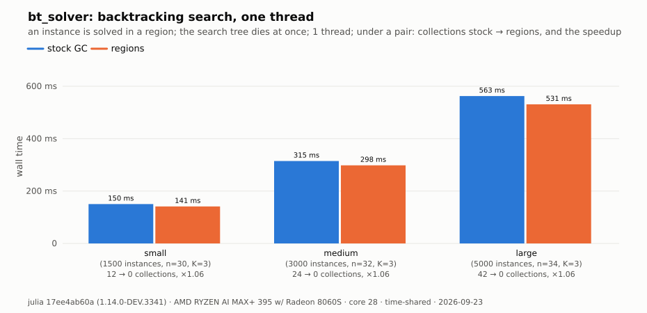

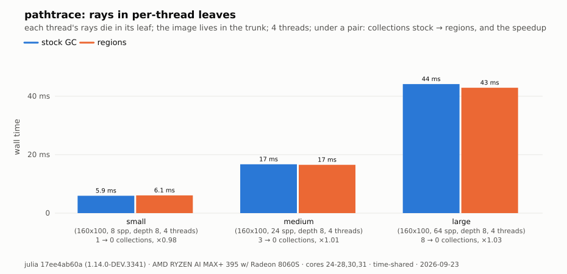

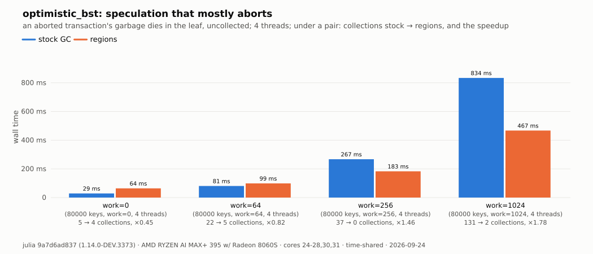

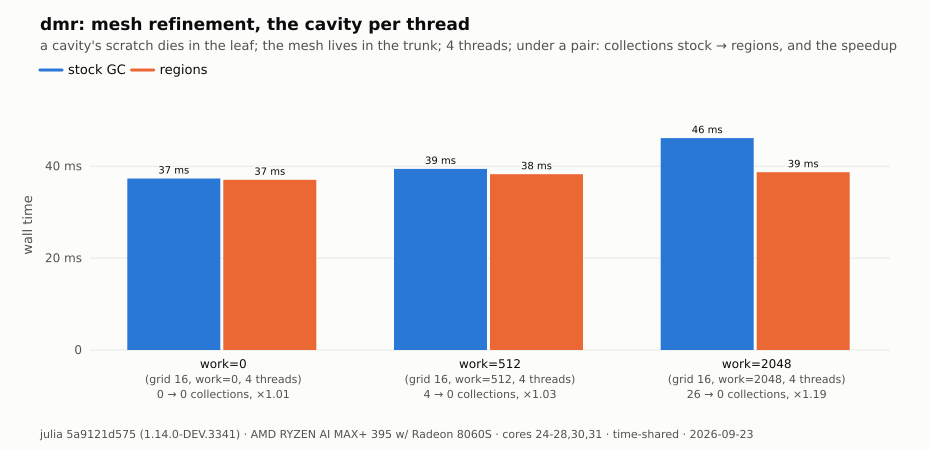

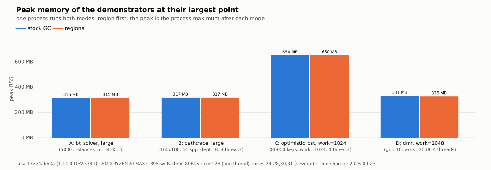

The speculative tree (C) is the crossover: 0.45 of the stock speed with no
work per transaction, 1.78 with 1,024 units of it.

### M11 — The discipline checker

**Claim.** The checker finds the stores of the allocating model that break
the region rule, and finds none in the clean model, without a region in
use.

<!-- table M11 run=checked -->
<!-- /table -->

## Where the master line differs from the release-1.13 line

- The store's guard costs 0.045 ns instead of 0.085: master's write barrier
  is field-aware now and the guard sits inside it.
- The full parallel collection costs 8 to 9 % more at thirty threads, as it
  did at thirty-two; the probe build now says that the mark's census filter
  is most of it.
- The checked reset costs 27 µs alone, as before; the unchecked one 30 ns.
- The paced loop's worst completion is 6 to 9 µs where it was 5.6 µs, on a
  partition made at run time rather than at boot.
- Against the C++ program the region loop runs at 0.83 with the barrier
  and 0.98 without it, where it ran at 0.85.
- The system image grows 8.9 % with the barrier built, where it grew 3.4 %;
  without the barrier it grows 2.7 %.
