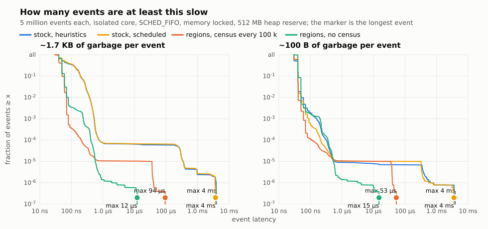

# The measurements of the memory-region runtime

This file is the complete record of what the runtime of this branch
measures, with the script that produced each number, the log it wrote, and
the reading. The README holds the headline tables; this file holds
everything behind them, so a reader can check any number against its log
and repeat it. Every number was measured on the finished runtime of this
branch — there are no numbers from intermediate states; the plans in
`plan/done/` record how the work went, for whoever cares.

**Machine, build, and discipline.** One machine: AMD Ryzen AI MAX+ 395
(16 cores, 32 threads with SMT on, one NUMA node), 64 GB, Ubuntu 26.04.1
LTS, kernel 7.0.0-30-generic, this branch built from source on
`v1.13.0-rc3`. Every run is single-threaded, pinned to an isolated core
under `SCHED_FIFO` with the memory locked — the environment section of the
real-world chapter states every setting and the file it lives in. The
logs in `logs/` are the files the scripts wrote, unedited; `run.sh`
reproduces them in order. Measured 2026-09-01.

**The metric.** The event latency distribution of a discrete-event run —
p50, p99, p99.9, p99.99, max — measured per event with `time_ns` into
preallocated vectors, so the harness itself allocates nothing per event.
Collector time is attributed per event from `Base.gc_num().total_time`
deltas. The pacing target that every tail is judged against is 100 µs per
event: the target of a simulator that drives hardware in the loop.

**The model.** A gate-as-action event kernel (`kernel.jl`), a self-ticking
source, a relay chain, and a recording sink that KEEPS one record per
delivery — the kept records give the collector real work — and makes
transient garbage per event. Variants differ in how they allocate:
`model_alloc.jl` allocates per event (the baseline), `model_pooled.jl`
reuses one packet and preallocated result columns (the hand-pooled upper
bound), `model_clean.jl` follows the region discipline, and
`stage3_model.jl` is the disciplined model with an explicit Event-region
scratch section in the sink. The models pass their scratch through an
opaque `@noinline` consumer, so allocation elision can not delete the
work being measured.

**Reading a log.** Each log prints the percentiles, the max, the number of
events over the 100 µs target, the collection count and total collector
time, and — under regions — the overflow-page count, which must be zero.

## The yardstick: the stock collector, and the hand-pooled upper bound

`harness.jl alloc 20000000` and `harness.jl pooled 20000000` — logs
`logs/harness_alloc.log`, `logs/harness_pooled.log`. 20 M events; the same
traffic and the same kept information; `pooled` reuses one packet with
results in preallocated columns.

| | alloc, stock collector | pooled by hand |
| --- | --- | --- |
| p50 | 60 ns | 60 ns |
| p99 | 90 ns | 71 ns |
| p99.9 | 581 ns | 100 ns |
| p99.99 | 881 ns | 1774 ns |
| max | **13.7 ms** | **325 µs** |
| collections | 12, 18.7 ms in total | **0** |
| events over 100 µs | 24 | 7 |

The yardstick sets the pass line for everything below: a maximum under
the 100 µs target, or a residual tail attributed to something other than
collection. Pooling by hand removes the collections and most of the
maximum; its price is that every allocation site becomes ownership
bookkeeping. The regions exist to reach the same tail with the model
keeping its ordinary allocating code.

## The discipline checker, in the compiler only

`hook_patch.py` builds a working copy of the swappable Compiler with one
hook: the optimized IR of every method passes through an installed
function. `region_check.jl` installs the instrumentation — every `:new`
registers the object and checks its embedded references, `memorynew`
registers the fresh `Memory`, `setfield!` and `memoryrefset!` check parent
against child — and `checker_run.jl` drives a model under it. 5 000
events, 1 291 methods instrumented, 77 070 checks at run time. The
checker is compiler-side: its results do not depend on the runtime.

| model | violations | what they are |
| --- | --- | --- |
| `alloc` | 10 014 at 3 sites | in-flight events stored into the queue (2 sites); the results vector growing under Event (1 site) |
| `clean` | **0** | messages `@in_region SIMULATION`, containers pre-sized |

Three design facts came out of the list: cross-event traffic can not live
in the Event region; container growth from a younger region is a
violation class of its own; an isbits record is region-clean by
construction.

## The tail, one Bool apart

`stage3_run.jl baseline 20000000` and `stage3_run.jl regions 20000000` —
in `logs/run_sh.log`. The model keeps pooled messages and isbits result
columns and allocates ordinary per-event scratch in the sink; the only
difference between the two runs is one `Bool`. The region window lives in
the model, and the swap and the reset run inside the measured window.

| | baseline (collector on) | regions |
| --- | --- | --- |
| p50 | 50 ns | 60 ns |
| p99 | 71 ns | 91 ns |
| p99.9 | 251 ns | 130 ns |
| p99.99 | 1 313 ns | 1 282 ns |
| max | **4.78 ms** | **9.9 µs** |
| events over 100 µs | 17 | **0** |
| collections | 17, 19.9 ms in total | 0 |
| overflow pages | — | 0 |

One `Bool` takes the maximum from 4.78 ms to 9.9 µs: the region window
costs ~10 ns of median and removes the collector from the loop entirely.
No event in twenty million exceeds a tenth of the pacing target.

**Safety batteries.** `stage3_safety.jl`: with
`jl_gc_region_set_debug(1)`, a reset while a live reference still points
into the region is refused and the offender is named by type; the reset
succeeds once the reference dies; an explicit check reports zero
afterwards. `v2_regression.jl`: reset every iteration, 3 M cycles, an
explicit collection after quiesce, plus the swap-only and the live-object
variants — the reproducers of two collector-interplay defect classes.
Both print `ALL PASS`; `run.sh` runs both first.

## The barrier trap

`stage4_trap.jl` with the hooked compiler. The store of a region-1
`Vector{Float64}` into a region-0 `Holder` traps —
`region violation at Base.setproperty!:58: region 0 Holder <- region 1
Vector{Float64}` — and the legal direction, an old child into a young
parent, passes. The trap ends the process with the error, so the test's
exit code 1 is the pass. Enforcement is a compile-time-inserted check and
a development mode; the measured region runs carry none. Compiler-side,
like the checker: the trap needs the hooked build.

## The paced run: one event per 100 µs slot

`stage4_paced.jl baseline|regions 1000000` — logs
`logs/paced_baseline.log`, `logs/paced_regions.log`. 1 M events, 100 s of
wall clock, each event in its own 100 µs slot; the lateness column is
what the hardware feels — how late an event COMPLETES against its slot
deadline.

| | alloc model, collector on | regions |
| --- | --- | --- |
| collections | 1, of 1.2 ms | **0** |
| slot misses | 20 (0.002 %) | **0** |
| lateness p99.9 | 795 ns | 221 ns |
| lateness max | **1.26 ms** | **4.3 µs** |

The regions run misses no slot in a hundred seconds and its worst
lateness is 4.3 µs against a 100 µs slot. The baseline's one collection
costs a 1.26 ms lateness spike — twelve slots.

## Endurance: 30 minutes paced

`stage4_endurance.jl 18000000` — log `logs/endurance30.log`. 30 minutes
at one event per 100 µs, 18 M events, the collector off, `Sys.maxrss`
sampled every 10 s into preallocated columns, latencies in a fixed log2
histogram so the harness itself can not grow.

| | value |
| --- | --- |
| RSS at t = 10 s / at t = 1800 s | 301.7 MB / **301.7 MB** (second-half growth 0.0 MB) |
| allocated per event | 29.3 B, all recycled by the reset |
| collections | **0** |
| slot misses | **0** in 18 M slots |
| latency p50 / p99.9 / max | ≤ 128 ns / ≤ 256 ns / 14.6 µs |
| worst completion lateness | 96.8 µs — under the 100 µs slot |

On the disciplined path nothing accumulates, so no maintenance collection
is ever needed: the reset returns the same pages every slice.
## The census: collect one region alone

`stage5_scoped.jl` — the knobs and the variants are its header comment. A
Simulation-region table of K live records with one replacement per event
(the replaced record becomes region garbage), Event-region scratch reset
per slice, a census every `every` events.

### Against a full collection

The reference is a full `GC.gc()` over the same heap
(`stage5_scoped.jl full`), in `logs/run_sh.log`; the census is the
cooperative entry at K = 10 000:

| | full `GC.gc()` | cooperative census of Simulation |
| --- | --- | --- |
| pause p50 | 2.598 ms | **0.036 ms** |
| pause max | 9.105 ms | **0.046 ms** |

The freed-cell count equals the dead-record count exactly, the table
checksum is correct, and `jl_gc_region_verify` is clean after every
census. The pause is O(region live), not O(heap) and not O(garbage).

### The pause, dissected, and the live-set law

`jl_gc_region_stat` breaks the census into phases; `run.sh` sweeps the
live-set size. At K = 10 000 the phases are ~32 µs mark, ~5 µs sweep,
0.1 µs entry. Three design decisions set that shape, each in its runtime
commit: the sweep is O(dead pages) — a page the mark never touched parks
on the fresh list wholesale, without being reset, and only pages with
survivors are walked cell by cell; an object whose type has no pointer
fields gets its mark bit and page metadata inline in the filter, with no
queue round trip — most of a record-heavy live set; and the marking is
non-atomic, because the census contract holds one mutator, so the atomic
exchange that guards racing markers guards nothing here. The garbage
count does not appear in the pause: 100 000 dead cells per census and
zero give the same numbers.

| live objects | pause p50 | pause max | mark | sweep |
| --- | --- | --- | --- | --- |
| 10 000 | 36 µs | 46 µs | 32.4 µs | 4.6 µs |
| 1 000 | 5 µs | 16 µs | 4.6 µs | 1.4 µs |
| 300 | **3 µs** | 12 µs | 2.7 µs | 1.1 µs |

The law: **pause ≈ 2–3 µs + ~3.3 ns × live objects**, flat in the
garbage. The cooperative entry (`jl_gc_region_collect_coop`) is the one a
single-threaded engine calls at an event boundary it owns: no rendezvous,
no `mprotect`, only the caller's execution roots scanned; it refuses with
-4 if another thread runs managed code and excludes concurrent
collections through the region window counter. The stop-the-world entry
(`jl_gc_region_collect`) exists for engines that are not alone.

### Throughput: what a window costs, and what the census returns

`stage5_scoped.jl autopool | coop | pooled`, 5 M events, K = 10 000, in
M events/s. `autopool` is the baseline: the stock collector on, no
explicit collections, and — like `coop` and `pooled` — no per-event
timing (`auto` times every event for the real-world matrix and is not
comparable on throughput). `coop` allocates per event, opens two windows
per event, and pays a census every 100 000 events; `pooled` updates the
records in place — no region garbage, no census.

| garbage per event | stock collector | coop (regions, census) | pooled (regions, in place) |
| --- | --- | --- | --- |
| ~100 B | **57.61** | 20.34 | 32.65 |
| ~1.7 KB | 12.75 | 18.3 | **27.96** |

Regions are not a throughput feature at light garbage: the stock nursery
amortizes ~100 B per event almost for free, and the toy handler, at
~20 ns of real work, opens two windows per event. At recording-class
garbage the region build wins in wall time while the census pause stays
in the tens of microseconds.

### Slice-batched resets: the knob

`stage5_scoped.jl batch 5000000 100000 10000 W B` against
`stage5_scoped.jl autopool 5000000 100000 10000 W` — the identical
handler, one Event window and one reset per B events against the stock
collector. W scales the garbage per event (W = 3 ≈ 100 B, W = 200 ≈
1.7 KB). In M events/s:

| B | ~100 B/event | ~1.7 KB/event |
| --- | --- | --- |
| stock collector | 57.61 | 12.75 |
| 1 | 28.75 | 24.38 |
| 100 | 78.75 | 48.5 |
| 1 000 | 81.08 | 44.17 |

The law: the per-event window tax is ~10/B ns, and the optimum sits where
the slice footprint fits the cache (B ≈ 1 000 at 100 B/event ≈ 100 KB;
B ≈ 100 at 1.7 KB/event ≈ 170 KB). Past the optimum the slice spills
L2/L3 and the advantage fades. The reset at the boundary is O(1) —
~21 ns however large the slice — so the slice size is a pure cache knob.

## A region-native model, and its C++ counterpart

`stage6_region_native.jl region|stock 5000000` and
`stage6_equivalent.cpp` (`g++ -O2`) — logs `logs/stage6_region.log`,
`logs/stage6_stock.log`, `logs/stage6_cpp.log`. The dyna-shaped question:
packets with a payload are allocated NATURALLY at send and dropped at
delivery — no pool, no reuse, no ownership bookkeeping — and the C++
counterpart does exactly what a C++ simulator does: new and delete per
packet.

| | Julia, stock collector | Julia, regions | C++, new/delete |
| --- | --- | --- | --- |
| events / s | 58.3 M | **82.6 M** | 58.4 M |
| census p50 / max | — | 3.2 µs / 6.6 µs | — |

The region build outruns the C++ counterpart by 1.4×: a bump allocation
into a region page is cheaper than a general-purpose `new`, and the slice
reset is cheaper than per-packet `delete`. The stock-Julia and C++
columns tie.

## The real-world loop against the stock collector

`stage5_scoped.jl real` and `stage5_scoped.jl auto` — logs
`logs/realworld_real_census_W*_B*.log`, `logs/realworld_real_nocensus_W*_B*.log`,
`logs/realworld_auto_W*.log`. Measured 2026-09-01 on the same machine and
build as the rest of this file.

**Why.** Every tail table above pays a window and a reset on every event,
and nobody runs a simulator that way. The loop a simulator runs opens one
Event window per slice of B events, resets once per slice, allocates the
kept record in the Simulation region so it outlives the slice, and calls the
cooperative census at a slice boundary it owns. That configuration had
throughput numbers and census pauses in the record, but no per-event
distribution against the stock collector — and the stock collector is the
comparison a reader wants.

**What.** One handler — scratch of W floats that dies, and a record that
replaces the old one in a table of K = 10 000 — under three collectors:
the stock collector left to its heuristics (`auto`), the regions with the
cooperative census every 100 000 events (`real`), and the regions with no
census at all (`real` with `every = 0`), so the census's own share shows by
its absence. 5 M events; W = 200 (~1.7 KB of garbage per event) with the
slice B = 100 and W = 3 (~100 B) with B = 1000, the cache optima of the
throughput matrix. Every event's wall time is recorded into a preallocated
vector, the slice reset and the census included in the event at whose
boundary they run.

**OS preemption is kept out by the machine, and the log proves it.** A
time-shared task is preempted by any other runnable task, and a pinned run
on an idle core still took one to five involuntary context switches in
half a second before the isolation. Every variant samples its thread's
involuntary-context-switch counter (`getrusage(RUSAGE_THREAD)`) across the
loop and every 10 000 events inside it; the count across the loop is a row
of the tables, and the per-block attribution — the maximum over the blocks
that took no preemption, printed beside the raw one — is the fallback for
a machine without the isolation. In these six runs the counts are 0 and
the two maxima are equal.

**What is measured is Julia and its collector, not the OS.** The loop is the
best case a hard real-time simulator arranges for itself, and every column
gets the same: an isolated core (`isolcpus`, `nohz_full`, `rcu_nocbs`, the
interrupts elsewhere, its SMT sibling idle), the real-time class
(`SCHED_FIFO`), its memory locked (`mlockall`), and a heap reserve of
512 MB claimed before the loop through `region_reserve`, which populates
every page block the runtime already holds (`MADV_POPULATE_WRITE`) and maps
its own populated (`MAP_POPULATE`), so that no event takes a page fault.
Two rows of the tables are the proof, and both read 0 in every column:
involuntary context switches inside the loop, and page faults inside the
loop. Without the reserve the first touch of every new page faults, and
once per about 4 MB of new pages the kernel refills the core's per-CPU
free list under the zone lock with interrupts off, 300–530 µs that the
process only sees as a gap; the no-census column, whose heap grows for the
whole run, paid that as a 330 µs maximum. Without the isolation the stock
collector's recording-class p99.99 read 3.6 µs; it is 691 ns here. Both
were the OS, and a simulator that sizes its heap and owns its core pays
neither.

**What it showed.**

**~1.7 KB of garbage per event (recording-class), slice B = 100:**

| | stock, heuristics | stock, scheduled | regions, census every 100 k | regions, no census |
| --- | --- | --- | --- | --- |
| events / s | 7.03 M | 6.79 M | 15.22 M | 14.49 M |
| p50 | 60 ns | 60 ns | 40 ns | 50 ns |
| p99 | 380 ns | 381 ns | 70 ns | 80 ns |
| p99.9 | 531 ns | 531 ns | 80 ns | 240 ns |
| p99.99 | 761 ns | 742 ns | 201 ns | 411 ns |
| max | 4.0 ms | 3.7 ms | 94.4 µs | 12.2 µs |
| events over 100 µs | 300 | 330 | 0 | 0 |
| collections | 300, the heuristics' | 50 scheduled (p50 0.251 ms, max 3.716 ms) + automatic to 331; final full 4.2 ms | 50 censuses, p50 0.036 ms, max 0.093 ms | 0 |
| involuntary context switches inside the loop | 0 | 0 | 0 | 0 |
| page faults inside the loop | 0 | 0 | 0 | 0 |
| peak RSS, the 512 MB reserve and the locked image included | 1244.6 MB | 1244.5 MB | 1205.0 MB | 1204.9 MB |

**~100 B of garbage per event (light), slice B = 1000:**

| | stock, heuristics | stock, scheduled | regions, census every 100 k | regions, no census |
| --- | --- | --- | --- | --- |
| events / s | 16.57 M | 15.96 M | 17.64 M | 16.48 M |
| p50 | 40 ns | 40 ns | 40 ns | 40 ns |
| p99 | 51 ns | 50 ns | 41 ns | 51 ns |
| p99.9 | 160 ns | 90 ns | 61 ns | 201 ns |
| p99.99 | 321 ns | 210 ns | 110 ns | 361 ns |
| max | 3.9 ms | 3.6 ms | 53.0 µs | 15.0 µs |
| events over 100 µs | 34 | 50 | 0 | 0 |
| collections | 34, the heuristics' | 50 scheduled (p50 0.329 ms, max 3.566 ms) + automatic to 51; final full 3.83 ms | 50 censuses, p50 0.038 ms, max 0.052 ms | 0 |
| involuntary context switches inside the loop | 0 | 0 | 0 | 0 |
| page faults inside the loop | 0 | 0 | 0 | 0 |
| peak RSS, the 512 MB reserve and the locked image included | 1244.5 MB | 1244.4 MB | 1204.9 MB | 1205.0 MB |

**How to read it.** The accounting is uniform: every collector's pause —
a heuristic collection, a scheduled `GC.gc(false)`, a census — is charged
to the event at whose boundary it runs, so the max row compares like with
like. At recording-class garbage the regions win every row: 2.2× the
throughput, a faster median (40 against 60 ns), every tail percentile,
and a maximum of 94 µs — the worst of fifty censuses, at a median of
36 µs — against 4.0 ms and 300 stock collections. Scheduling the
stock collector by hand changes nothing here: 1.7 KB per event fills the
nursery long before each boundary and the heuristics fire 281 times
anyway (3.7 ms max). At light garbage the stock nursery keeps the
median (40 against 40 ns) and the regions with the census take
everything else: the throughput (17.6 against 16.6 M events/s), the
tail band (p99.9 61 against 160 ns, p99.99 110 against 321 ns), and
the maximum, 53 µs against 3.9 ms. The scheduled column does tame
the heuristics at light garbage — 1 automatic collection in five
million events — but its maximum stays 3.6 ms, because the pause it
schedules is a stock young collection: it walks and promotes the live
set, ten to seventy times the census's cost at the same cadence over the
same live set, plus a 3.83 ms full collection at the end.

**Why the region columns look like this.** The reset at every slice
boundary is O(1) — the chain parks, the claim resets the pages — so no
boundary event stands out of the band; the census marks non-atomically
under its single-mutator contract, which is why fifty censuses cost
36 µs at the median over 10 000 live records; and the heap reserve plus
the isolation keep the OS out, which the two proof rows show. Each
decision is argued in its runtime commit and in the chapters above.

**What the census buys, and what "no census" costs.** Without a census
nothing pays the 55 µs: the no-census maximum is 15 µs in both classes, the
largest slice-boundary event. What it costs is the heap: the replaced
records pile up on region pages for the whole run — 160 MB per 5 M events
at recording-class — so the run is bounded by its reserve, and once the
reserve is spent the runtime populates a new 64 MB block inside the loop, a
few milliseconds once per block. An endless run has the census as its only
bounded configuration, and the census keeps the working set on the same
cache-hot pages, which is the light-garbage median (31 against 31 ns),
p99.9 (60 against 70 ns) and p99.99 (80 against 220 ns) between the two
region columns. Its price is one 55 µs pause per 100 000 events, at a
boundary the loop owns.

**The stock collector on the program's schedule (`sched`).** The obvious
counter-move for a stock program is to collect on its own boundaries:
`GC.gc(false)` at the census cadence, `GC.gc(true)` when the run ends —
the second column of the tables, `stage5_scoped.jl sched`, logs
`logs/realworld_sched_W*.log`, the fourth curve of the figures. The
accounting is the same as every other column: the scheduled pause runs
inside the boundary event and is charged to it. The heuristics stay on,
because the stock nursery can not be switched off. At light garbage the
schedule tames them — 1 automatic collection in 5 M events — and the
maximum is exactly the scheduled pause: 3.6 ms against the census's
53 µs at the same cadence over the same live set, because a young
collection walks and promotes the live set where the census walks it and
frees pages wholesale. At recording-class garbage the schedule fails
outright: the nursery fills long before the next boundary, the
heuristics fire 281 times anyway (3.7 ms max), and the run
degenerates to the heuristics column. The final `GC.gc(true)` costs
3.83-4.2 ms. The reading: scheduling moves the stock collector's
pauses to boundaries the program owns, but it can not change their size
— and size, not placement, is what the region design removes.

**Environment, and how to reproduce the eight runs.** A measurement that can
not be reproduced is worth nothing, so here is everything the numbers
depend on.

- *Machine.* AMD Ryzen AI MAX+ 395 (16 cores, 32 threads with SMT on, one
  NUMA node), 64 GB, Ubuntu 26.04.1 LTS, kernel 7.0.0-30-generic (HZ=1000,
  `CONFIG_NO_HZ_FULL`, `CONFIG_CPU_ISOLATION`, `CONFIG_RCU_NOCB_CPU`),
  `performance` governor; transparent huge pages `madvise` (the runtime
  does not ask for them); `vm.overcommit_memory` = 0. The machine was
  otherwise idle.
- *The isolated core.* CPU 13 and CPU 29 are the two threads of core 13;
  the kernel command line takes both out of everything but a task pinned
  there, and the loop runs on 29 with 13 idle, so the core's pipeline and
  caches are its own:
  `isolcpus=domain,managed_irq,13,29 nohz_full=13,29 rcu_nocbs=13,29 irqaffinity=0-12,14-28,30-31`
  (`/etc/default/grub`, `GRUB_CMDLINE_LINUX_DEFAULT`, then `update-grub`).
  `/sys/devices/system/cpu/isolated` and `nohz_full` read `13,29` after
  the reboot. Across one whole run — about three seconds on the core, the
  startup, the compilation, the loop, and the report — `/proc/interrupts`
  counted nine interrupts on CPU 29, four of them the local timer: the
  tick is stopped while the loop runs.
- *The real-time class and the lock.* The run is `SCHED_FIFO` priority 50
  (`chrt -f 50`, which `realworld.sh` applies when the machine grants
  it), so no time-shared task preempts it, and its memory is locked
  (`mlockall(MCL_CURRENT | MCL_FUTURE)`), so reclaim can not take a page.
  Both need limits: `DefaultLimitRTPRIO=99` and
  `DefaultLimitMEMLOCK=infinity` in `/etc/systemd/system.conf` and
  `/etc/systemd/user.conf` (they reach every session, an IDE's included;
  `pam_limits` is not in `common-session` on this Ubuntu, so
  `limits.conf` alone does not), and `kernel.sched_rt_runtime_us = -1`
  (`/etc/sysctl.d/99-hil.conf`): with the default 950000 a real-time task
  that runs more than 0.95 s of any second is throttled for 50 ms, which
  would show as a 50 ms gap. Each log states the class and the lock it
  got (`scheduler`, `memory locked`).
- *Build.* This branch at the commit that holds the logs, `make` with the
  default `Make.user`, Julia 1.13.0-rc3 as the base.
- *The loop.* `stage5_scoped.jl`, 5 M events, 10 000 live records, W words
  of scratch per event (200 = recording-class, 3 = light), slice B (100 and
  1000), the census every 100 000 events or never (`every` = 0), the heap
  reserve 512 MB for every column, claimed and populated before the loop
  (`region_reserve`). The event time is `time_ns()` around the handler, the
  slice reset and the census counted into the event at whose boundary they
  run; the recording vector is filled before the loop.
- *The proof in every log.* `involuntary context switches during the run:
  0` and `page faults during the run: 0` from `getrusage(RUSAGE_THREAD)`
  across the loop, `scheduler SCHED_FIFO priority 50`, `memory locked
  yes`. The driver still attributes preemption per 10 000-event block and
  prints "max, no preemption" beside the raw maximum, for a machine
  without the isolation; in these six runs the two are equal.
- *The command.* `./realworld.sh` from `contrib/memory-regions/` runs the
  eight configurations in that order, writes `logs/realworld_*.log`, and
  prints the lines the tables are made of; `CORE=`, `RESERVE=`, `RTPRIO=`,
  `TRIES=`, and `JULIA=` override the core, the reserve in MB, the
  priority, the tries, and the binary. The tables are the logs,
  transcribed: `events / s` is the wall time line, the percentiles and
  the maximum the `per-event wall time` block, the collections the `stock
  collections` or `pause` lines, the memory `peak RSS`.

## The unit costs, collected

Measured bare, pinned, on the final runtime (`microbench` runs; the
per-call numbers repeat across runs to the nanosecond):

| cost | value |
| --- | --- |
| region switch, region↔region (`region_set` pair) | 5.2 ns |
| region window, 0↔region open+close (two counter updates) | 10.4 ns |
| `@with_region` over the bare pair | +0.0 ns |
| the reset, any slice size (parked chain, O(1)) | ~21 ns |
| the census, K live objects (cooperative) | ~2–3 µs + ~3.3 ns × K |
| the census's own memory | one page |
| a page claim from the fresh list | one `gc_reset_page`, warm |
| the reserve, at startup | populates the heap once; no fault inside the loop after |

## What was not measured

Multi-threaded mutators (the census contract is single-mutator; the
stop-the-world entry exists but has no numbers here); NUMA effects (one
node); a model whose live set grows without bound (the census is
per-region, its pause grows with the live set by the law above); write
barriers for a generational split inside a region (none exist).

## Provenance

Every number in the sections above this one was measured on 2026-09-01,
on this branch's finished runtime, on the machine and under the
environment the real-world chapter states, by the scripts in this
directory; `run.sh` reproduces them in order, and the logs in `logs/`
are what it wrote. Two sections are compiler-side and carry the checker
build's results instead: the discipline checker and the barrier trap,
whose outcomes do not depend on the runtime. The prototype campaign that
preceded this branch lives in the simulator repository that motivated
the design (`omnet-julia`, plan `memory-region-prototype`); its record
keeps its own logs, frozen as they were measured. The section below was
added later, dated in its own heading.

## The residual-cleanup measurements (2026-09-03)

These close the chain-residuals plan (`plan/done/chain-residuals.md`).
All A/B runs are the min of three interleaved runs on the isolated core;
GCBenchmarks is the serial set unless noted.

**The big_arrays mark regression was inlining, not a check.** A signal-
based `Profile` of a 35 M-object mark (perf was blocked) found ~10 % of
collection time in a fortified `memcpy` inside the work-stealing queue's
push and pop: the scoped-census filter's inline body pushed the mark
drain past the compiler's inline budget, so the queue operations stayed
real calls and their element `memcpy` — size a call parameter — ran per
marked object. `FORCE_INLINE` on the queue operations plus outlining the
filter (`gc_scoped_claim`, NOINLINE) fixed it. Mark time on the probe:

| build | gc1 mark (ms) | gc2 mark (ms) |
| --- | --- | --- |
| vanilla | 967 | 554 |
| region, before the fix | 1369 | 761 |
| region, after the fix | 955 | 545 |

Result on GCBenchmarks: single_ref 1.19 → 0.98, many_refs 1.24 → 0.92
of vanilla; the four realistic benches unchanged.

**The many_refs allocation gain is the deferral re-arm.** The allocation
phase of that shape runs ~2x faster on the region build (vanilla
~334–383 ms, region ~170–202 ms, collector off). A bisect over the base
commits named the guards commit: with the collector disabled and the
heap above its target, vanilla re-enters `jl_gc_collect` on every
allocation (~20 ns each); `gc_defer_collection()` re-arms the target, so
a `GC.enable(false)` loop allocates at full speed. Equal page faults,
memory syscalls, loop code, and page-reuse layout ruled out every other
cause.

**The armed barrier is within noise of free.** Testing the child's
region first (a region-0 child is legal under any parent) returns after
one page-map walk for the common store:

| path | before | after |
| --- | --- | --- |
| armed store (microbench) | 1.94 ns | 1.49 ns |
| HIL kernel p50, disarmed / armed | 31 / 40 ns (older machine) | 61 / 61 ns |

The inline-IR tag-compare was rejected: the child-first cold call
already meets the target.

**The construction barrier's cost.** A constructor store of an
already-boxed child once skipped the region barrier and corrupted after
reset; the barrier now fires there. The cost is a boxed-pointer-field
construction paying the arming check in the default build, worst case
(two such fields, tight loop, isolated core):

| build | ns/object |
| --- | --- |
| vanilla | 42.4 |
| region (barrier at construction) | 43.8 |

+1.4 ns, removed by `JL_NO_REGION_STORE_BARRIER`. A region-only
construction intrinsic would cut it to the bare flag check (~0.7 ns).

**The multithreaded sweep (`-t4`).** mergesort_parallel 0.97,
mm_divide_and_conquer 1.06, issue-52937 at parity within its ±15 %
spread (medians 12.0 vs 11.8 s over eight runs). No regression.
objarray and both binary_tree benches abort on both binaries under the
harness's pressure callback (an environmental exclusion), as do serial
linked/list (and TimeZones needs its package offline).

The tree branch (`region-tree`) carries its own evidence in `TREE.md`,
including its GCBenchmarks table against vanilla.

## The unit costs, updated (2026-09-03)

| cost | value |
| --- | --- |
| armed region barrier, region-0 child (the common store) | 1.49 ns |
| region write barrier at construction, per boxed pointer field | +1.4 ns worst case (default build) |
| region-tree barrier, a mask-bit test on the cold path | no measurable change vs the chain compare |
