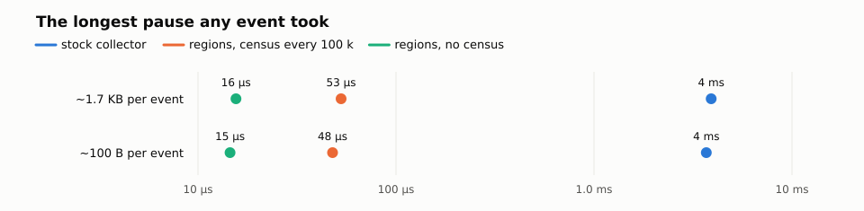

# Memory regions: the Julia face

**The longest pause any event took, in one unit — the number that decides
whether a hard real-time loop is possible.** The same loop, 5 million
events, ~1.7 KB of garbage per event, on an isolated core under the
real-time class, no page fault and no preemption inside the loop:

## stock collector: 3 905 µs

## regions, census every 100 000 events: 53 µs

## regions, no census: 16 µs



The stock number is one of its 300 collections, and scheduling the
stock collector by hand does not change it at this garbage rate (the
tables have that fourth column); the census number is the census itself,
at a slice boundary the loop owns; the no-census number is the largest
slice-boundary event. At ~100 B of garbage per event the three read
3 690, 48, and 15 µs. The plots, the tables, and the section on the
environment below say exactly how the numbers were made; `plot_realworld.py`
redraws the plots from the logs.

The runtime of this branch adds regions to the stock collector — sets of
objects with one common lifetime, kept safe by one rule: a reference may
only point to an object of equal or longer lifetime. [DESIGN.md](DESIGN.md)
is the design; the commits before this one are the runtime, one idea each.
This directory is the Julia side: `regions.jl` wraps the runtime entry
points so a program can open a region, come back, reset it, and ask for a
census of it; the examples and the batteries measure it; and
[MEASUREMENTS.md](MEASUREMENTS.md) is the complete record of every
measurement — the script, the log in `logs/`, the numbers, the reading.

## The real-world loop, against the stock collector

Nobody resets per event. A simulator opens one Event window per slice of B
events, resets once per slice (about 10 ns per page, on the same cache-hot
pages), allocates what must outlive the slice — here the kept record — in the
Simulation region, and calls the cooperative census at a slice boundary it
owns. `stage5_scoped.jl real` is that loop; `stage5_scoped.jl auto` is the
same handler under the stock collector, left to its own heuristics. Both
record every event's wall time, the slice reset and the census included in
the event at whose boundary they run. 5 M events, 10 000 live records, the
census every 100 000 events, the slice at the cache optimum of the throughput
matrix, on an isolated core under the real-time class, the heap claimed
and populated before the loop.

**What is measured is Julia and its collector, not the OS.** The loop is the
best case a hard real-time simulator arranges for itself, and every column
gets the same: an isolated core (`isolcpus`, `nohz_full`, `rcu_nocbs`, the
interrupts elsewhere, its SMT sibling idle), the real-time class
(`SCHED_FIFO`), its memory locked (`mlockall`), and a heap reserve of
512 MB claimed before the loop through `region_reserve`, which populates
every page block the runtime already holds (`MADV_POPULATE_WRITE`) and maps
its own populated (`MAP_POPULATE`), so that no event takes a page fault.
Two rows of the tables are the proof, and both read 0 in every column:
involuntary context switches inside the loop, and page faults inside the
loop. Without the reserve the first touch of every new page faults, and
once per about 4 MB of new pages the kernel refills the core's per-CPU
free list under the zone lock with interrupts off, 300–530 µs that the
process only sees as a gap; the no-census column, whose heap grows for the
whole run, paid that as a 330 µs maximum. Without the isolation the stock
collector's recording-class p99.99 read 3.6 µs; it is 691 ns here. Both
were the OS, and a simulator that sizes its heap and owns its core pays
neither.

"No census" is a configuration the regions alone have: the slice reset
already reclaims every transient, so the only thing left for a census is the
turnover — the replaced records — and without one they pile up on region
pages, memory traded for the census pause. The stock collector has no such
option; its nursery collection is what reclaims everything, and switched off
it fills memory in seconds. So the stock column is the collector left to
its heuristics, as it must be.

**OS preemption is kept out by the machine, and the log proves it.** A
time-shared task is preempted by any other runnable task, and a pinned run
on an idle core still took one to five involuntary context switches in
half a second before the isolation. Every variant samples its thread's
involuntary-context-switch counter (`getrusage(RUSAGE_THREAD)`) across the
loop and every 10 000 events inside it; the count across the loop is a row
of the tables, and the per-block attribution — the maximum over the blocks
that took no preemption, printed beside the raw one — is the fallback for
a machine without the isolation. In these six runs the counts are 0 and
the two maxima are equal.


**~1.7 KB of garbage per event (recording-class), slice B = 100:**

| | stock, heuristics | stock, scheduled | regions, census every 100 k | regions, no census |
| --- | --- | --- | --- | --- |
| events / s | 7.16 M | 7.13 M | 15.54 M | 15.63 M |
| p50 | 60 ns | 60 ns | 40 ns | 40 ns |
| p99 | 371 ns | 370 ns | 70 ns | 70 ns |
| p99.9 | 521 ns | 521 ns | 80 ns | 230 ns |
| p99.99 | 761 ns | 671 ns | 211 ns | 411 ns |
| max | 3.9 ms | 3.9 ms | 52.8 µs | 15.6 µs |
| events over 100 µs | 300 | 273 | 0 | 0 |
| collections | 300, the heuristics' | 50 scheduled (p50 0.25 ms, max 4.242 ms) + automatic to 324; final full 4.41 ms | 50 censuses, p50 0.036 ms, max 0.052 ms | 0 |
| involuntary context switches inside the loop | 0 | 0 | 0 | 0 |
| page faults inside the loop | 0 | 0 | 0 | 0 |
| peak RSS, the 512 MB reserve and the locked image included | 1253.1 MB | 1244.1 MB | 1204.4 MB | 1204.5 MB |

**~100 B of garbage per event (light), slice B = 1000:**

| | stock, heuristics | stock, scheduled | regions, census every 100 k | regions, no census |
| --- | --- | --- | --- | --- |
| events / s | 16.88 M | 16.54 M | 18.02 M | 18.3 M |
| p50 | 30 ns | 31 ns | 31 ns | 30 ns |
| p99 | 50 ns | 41 ns | 41 ns | 41 ns |
| p99.9 | 200 ns | 81 ns | 61 ns | 210 ns |
| p99.99 | 420 ns | 220 ns | 120 ns | 321 ns |
| max | 3.7 ms | 15.1 µs | 47.8 µs | 14.5 µs |
| events over 100 µs | 35 | 0 | 0 | 0 |
| collections | 35, the heuristics' | 50 scheduled (p50 0.319 ms, max 3.406 ms) + automatic to 51; final full 3.4 ms | 50 censuses, p50 0.036 ms, max 0.047 ms | 0 |
| involuntary context switches inside the loop | 0 | 0 | 0 | 0 |
| page faults inside the loop | 0 | 0 | 0 | 0 |
| peak RSS, the 512 MB reserve and the locked image included | 1244.1 MB | 1204.5 MB | 1204.4 MB | 1204.3 MB |

**How to read it.** At recording-class garbage the regions win every row:
2.2× the throughput, a faster median (40 against 60 ns), every tail
percentile (p99 70 against 371 ns, p99.9 80 against 521 ns), a maximum of
53 µs — the census itself, fifty of them at a median of 36 µs —
against 3.9 ms and 300 stock collections, zero events over the 100 µs
target against 300, and less memory. Scheduling the stock collector by
hand (`GC.gc(false)` at the census cadence — the second column) changes
nothing here: the nursery fills long before each boundary and the
heuristics fire 274 times anyway, inside events. At light garbage the
stock nursery keeps the median (30 against 31 ns) and the regions with
the census take everything else: the throughput (18.0 against 16.9 M
events/s), p99.9 (61 against 200 ns), p99.99 (120 against 420 ns), and
the maximum, 48 µs against 3.7 ms. The scheduled column DOES work at
light garbage — no event carries a collection, in-event max 15 µs —
but two things must be read together: its per-event distribution
excludes the scheduled pauses by construction (they run between events;
the census column's boundary event includes its census), and each
scheduled pause costs p50 0.319 ms with a maximum of 3.406 ms — ten to
seventy times the census at the same cadence over the same live set —
plus a 3.4 ms full collection at the end.

**Why the region columns look like this.** The reset at every slice
boundary is O(1) — the chain parks, the claim resets the pages — so no
boundary event stands out of the band; the census marks non-atomically
under its single-mutator contract, which is why fifty censuses cost
36 µs at the median over 10 000 live records; and the heap reserve plus
the isolation keep the OS out, which the two proof rows show. Each
decision is argued in its runtime commit and in `MEASUREMENTS.md`.

**What the census buys, and what "no census" costs.** Without a census
nothing pays the 55 µs: the no-census maximum is 15 µs in both classes, the
largest slice-boundary event. What it costs is the heap: the replaced
records pile up on region pages for the whole run — 160 MB per 5 M events
at recording-class — so the run is bounded by its reserve, and once the
reserve is spent the runtime populates a new 64 MB block inside the loop, a
few milliseconds once per block. An endless run has the census as its only
bounded configuration, and the census keeps the working set on the same
cache-hot pages, which is the light-garbage median (31 against 31 ns),
p99.9 (60 against 70 ns) and p99.99 (80 against 220 ns) between the two
region columns. Its price is one 55 µs pause per 100 000 events, at a
boundary the loop owns.

**Environment, and how to reproduce the six runs.** A measurement that can
not be reproduced is worth nothing, so here is everything the numbers
depend on.

- *Machine.* AMD Ryzen AI MAX+ 395 (16 cores, 32 threads with SMT on, one
  NUMA node), 64 GB, Ubuntu 26.04.1 LTS, kernel 7.0.0-30-generic (HZ=1000,
  `CONFIG_NO_HZ_FULL`, `CONFIG_CPU_ISOLATION`, `CONFIG_RCU_NOCB_CPU`),
  `performance` governor; transparent huge pages `madvise` (the runtime
  does not ask for them); `vm.overcommit_memory` = 0. The machine was
  otherwise idle.
- *The isolated core.* CPU 13 and CPU 29 are the two threads of core 13;
  the kernel command line takes both out of everything but a task pinned
  there, and the loop runs on 29 with 13 idle, so the core's pipeline and
  caches are its own:
  `isolcpus=domain,managed_irq,13,29 nohz_full=13,29 rcu_nocbs=13,29 irqaffinity=0-12,14-28,30-31`
  (`/etc/default/grub`, `GRUB_CMDLINE_LINUX_DEFAULT`, then `update-grub`).
  `/sys/devices/system/cpu/isolated` and `nohz_full` read `13,29` after
  the reboot. Across one whole run — about three seconds on the core, the
  startup, the compilation, the loop, and the report — `/proc/interrupts`
  counted nine interrupts on CPU 29, four of them the local timer: the
  tick is stopped while the loop runs.
- *The real-time class and the lock.* The run is `SCHED_FIFO` priority 50
  (`chrt -f 50`, which `realworld.sh` applies when the machine grants
  it), so no time-shared task preempts it, and its memory is locked
  (`mlockall(MCL_CURRENT | MCL_FUTURE)`), so reclaim can not take a page.
  Both need limits: `DefaultLimitRTPRIO=99` and
  `DefaultLimitMEMLOCK=infinity` in `/etc/systemd/system.conf` and
  `/etc/systemd/user.conf` (they reach every session, an IDE's included;
  `pam_limits` is not in `common-session` on this Ubuntu, so
  `limits.conf` alone does not), and `kernel.sched_rt_runtime_us = -1`
  (`/etc/sysctl.d/99-hil.conf`): with the default 950000 a real-time task
  that runs more than 0.95 s of any second is throttled for 50 ms, which
  would show as a 50 ms gap. Each log states the class and the lock it
  got (`scheduler`, `memory locked`).
- *Build.* This branch at the commit that holds the logs, `make` with the
  default `Make.user`, Julia 1.13.0-rc3 as the base.
- *The loop.* `stage5_scoped.jl`, 5 M events, 10 000 live records, W words
  of scratch per event (200 = recording-class, 3 = light), slice B (100 and
  1000), the census every 100 000 events or never (`every` = 0), the heap
  reserve 512 MB for every column, claimed and populated before the loop
  (`region_reserve`). The event time is `time_ns()` around the handler, the
  slice reset and the census counted into the event at whose boundary they
  run; the recording vector is filled before the loop.
- *The proof in every log.* `involuntary context switches during the run:
  0` and `page faults during the run: 0` from `getrusage(RUSAGE_THREAD)`
  across the loop, `scheduler SCHED_FIFO priority 50`, `memory locked
  yes`. The driver still attributes preemption per 10 000-event block and
  prints "max, no preemption" beside the raw maximum, for a machine
  without the isolation; in these six runs the two are equal.
- *The command.* `./realworld.sh` from `contrib/memory-regions/` runs the
  six configurations in that order, writes `logs/realworld_*.log`, and
  prints the lines the tables are made of; `CORE=`, `RESERVE=`, `RTPRIO=`,
  `TRIES=`, and `JULIA=` override the core, the reserve in MB, the
  priority, the tries, and the binary. The tables are the logs,
  transcribed: `events / s` is the wall time line, the percentiles and
  the maximum the `per-event wall time` block, the collections the `stock
  collections` or `pause` lines, the memory `peak RSS`.

## Build

```
make -j$(nproc)        # at the repository root: builds ../../julia
```

Every script in this directory says at its top how it is run; all of them
take the branch's own build, `../../julia`.

## The rules, in five lines

1. Every object belongs to exactly one region, chosen at allocation,
   forever (no promotion).
2. Every allocation goes to the dynamically current region — including
   compiler-implicit ones (tuples, boxes, closures, exceptions).
3. A reference `a → b` is legal only when `b`'s region is an ancestor of
   `a`'s, or the same. A store that violates this is a defect, not a
   hint: a write barrier can trap on it exactly.
4. `reset!(r)` is legal when no execution root and no live younger object
   points into `r`. Rule 3 guarantees no OLDER object can.
5. A collection of `r` needs only the execution roots plus quiesced
   younger regions: older regions are implicitly live and never traced.

## The API

`regions.jl` is a small module; `include` it and `using .Regions`.

| call | runtime entry | what it does |
| --- | --- | --- |
| `region_set(n)` | `jl_gc_region_set` | make region `n` current; returns the previous region. Region 0 is the ordinary heap |
| `region_current()` | `jl_gc_region_current` | the current region |
| `region_reset(n)` | `jl_gc_region_reset` | free every object of region `n` (not current) in O(pages); returns the page count, or `typemax(UInt64)` when the debug check refuses |
| `region_of(x)` | `jl_gc_region_of` | the region of an object, from its page tag, in constant time |
| `region_collect(n)` | `jl_gc_region_collect` | the census: stop the world, mark region `n` from the execution roots, sweep only its pages; returns the freed cell count |
| `region_collect_coop(n)` | `jl_gc_region_collect_coop` | the same census with no stop-the-world, for a single-mutator engine at an event boundary it owns; `-4` when another thread runs managed code |
| `region_check(n)` | `jl_gc_region_check` | the rule-5 scan: live references into `n` from the execution roots, without a reset |
| `region_debug(on)` | `jl_gc_region_set_debug` | arm the rule-5 scan on every reset |
| `region_overflow(n)` | `jl_gc_region_overflow` | the pages region `n` had beyond one per pool |
| `@with_region n body` | (macro) | run `body` with region `n` current and come back to the previous region, however the body leaves; the readable form of a window - the hottest loop can keep the bare `region_set` pair |
| `region_reserve(bytes)` | `jl_gc_region_reserve` | claim and prefault `bytes` of heap before the loop: populates every block the runtime already holds (`MADV_POPULATE_WRITE`), maps whole blocks populated (`MAP_POPULATE`) into the clean pool, and populates every later block too; a loop whose heap fits takes no page fault. Returns the bytes mapped |

The reset, the check and the census are `@noinline` Julia calls on purpose:
a bare `ccall` is not a safepoint, so the caller would keep live references
in registers where the precise root scan can not see them. A Julia call is
a safepoint boundary — the caller spills every live value into its frame,
which is exactly what the rule-5 scan reads.

**What happens when the program calls `GC.gc()`.** Three cases, and the
incremental/full argument changes none of them. While any window is open,
the call defers: it collects nothing, re-arms the collection trigger, and
returns — a stray `GC.gc` inside a library can not corrupt a window. With
the windows closed and every region empty (quiesced), it works fully; the
guards keep region pages out of the mark and the sweep, and
`v2_regression.jl` proves this case. With the windows closed but a region
holding live objects, the collection runs and is UNSOUND — the mark sets
bits on region objects that the sweep never clears, and the next census
reads them stale. The contract, from the limits below: collect when the
regions are quiesced, or use the census; a loop like the real-world
driver simply turns the collector off for the run.

One rule the runtime does not check, and breaks the heap when it is broken:
**an array with malloc'd data — a `Vector` of more than about 2 KB — must
not die inside a region.** Its header is a small region object while its
data is kept by the runtime's own malloc list; a reset or a census frees the
header, the list still owns the data, and the next full collection corrupts
the heap. Keep such arrays in region 0, or make sure they outlive the region
(a table that lives for the whole run is fine — the census example keeps
one).

The shape of an event loop, from the design:

```julia
region_set(EVENT)
process_event!(...)
region_set(0)
region_reset(EVENT)          # after the extent: no stack can still point in
```

## Tests

Two batteries, both printing `ALL PASS`; `./run.sh` runs them:

- `v2_regression.jl` — the reproducer of the two collector-interplay defects
  the prototype found and fixed: reset every iteration, three million
  cycles, an explicit collection after quiesce, plus the swap-only and the
  live-object variants.
- `stage3_safety.jl` — the rule-5 check: with the debug scan armed, a reset
  while a live reference still points into the region is refused and the
  offender is named by type; the reset succeeds once the reference dies; an
  explicit check reports zero afterwards. The file documents the pinning
  idioms a test of region machinery needs against the optimizer
  (`Base.donotdelete`, `GC.@preserve`, an opaque callee).

## The examples, and the vanilla-Julia yardstick

Every example runs one small discrete-event kernel (`kernel.jl`): a
gate-as-action design whose run loop records every event's wall time into
preallocated vectors, so the harness itself allocates nothing per event.
The model is a self-ticking source, a relay chain, and a recording sink that
keeps one record per delivery — the kept records give a collector real work.

`harness.jl` runs two variants of that model on any julia, regions or not:

```
../../julia harness.jl alloc  20000000     # allocates per event: the stock collector's tail
../../julia harness.jl pooled 20000000     # one reused packet, preallocated columns: the upper bound by hand
```

The first is the yardstick — what ordinary Julia does. The second is the
best any lifetime discipline can reach, done by hand with no runtime change.
The regions have to reach the second line without the hand work.

## The tail bound, paced, and over thirty minutes

`stage3_model.jl` is the disciplined model: pooled messages, isbits result
columns, and an Event-region window around the sink's ordinary allocating
scratch. `stage3_run.jl` runs it with the window on or off — the two runs
differ by one `Bool`:

```
../../julia stage3_run.jl baseline 20000000
../../julia stage3_run.jl regions  20000000
```

`stage4_paced.jl` runs one event per 100 µs wall-clock slot and counts the
slot misses and their lateness — the hardware-in-the-loop question.
`stage4_endurance.jl` runs the paced loop for thirty minutes with the
collector off, sampling RSS every ten seconds, and answers whether memory
stays flat or a maintenance collection has to come back.

## The census, the throughput, and the slice knob

`stage5_scoped.jl` is the census example with every knob: a Simulation-region
table of K live records with one replacement per event, Event-region scratch
reset per event, a census every N events. Its variants:

| variant | what it does |
| --- | --- |
| `scoped` | the stop-the-world census |
| `coop` | the cooperative census, no stop-the-world |
| `pooled` | records updated in place — no region garbage, no census |
| `full` | a full `GC.gc()` as the reference |
| `auto` | the stock collector left to its heuristics |
| `batch` | one Event window and one reset per B events |
| `autopool` | the identical `batch` handler under the stock collector |

```
../../julia stage5_scoped.jl coop 2000000 100000 10000
../../julia stage5_scoped.jl batch 5000000 100000 10000 200 100
```

`./run.sh` now runs the whole set in order: the batteries, the tail bound,
the census frontier with the full-collection reference, the slice throughput
matrix, and the endurance sampler.

## The discipline checker, and the barrier trap

Rule 3 is enforced at development time by a compiler pass. `hook_patch.py`
builds a working copy of the Compiler with one hook — the optimized IR of
every method passes through an installed function — and `region_check.jl`
installs the instrumentation: every `:new` registers the object and checks
its embedded references, `memorynew` registers the fresh `Memory`, and
`setfield!` and `memoryrefset!` check the parent against the child.
`checker_run.jl` drives a model under it and prints a ranked list of
violations by (site, parent type, child type); `model_clean.jl` is the
disciplined model that yields none.

```
python3 hook_patch.py /tmp/regionck ../../julia
JULIA_LOAD_PATH=/tmp/regionck/env:@stdlib ../../julia checker_run.jl alloc 5000
JULIA_LOAD_PATH=/tmp/regionck/env:@stdlib ../../julia checker_run.jl clean 5000
JULIA_LOAD_PATH=/tmp/regionck/env:@stdlib ../../julia stage4_trap.jl
```

`stage4_trap.jl` proves the barrier with the runtime-backed check: the store
of a region-1 vector into a region-0 holder traps, and the legal direction
passes. The trap ends the process, so exit code 1 is the pass and exit
code 2 the failure.

## A region-native model, and its C++ counterpart

`stage6_region_native.jl` allocates packets with a payload naturally at send
and drops them at delivery — no pool, no reuse, no ownership bookkeeping —
with the whole simulation in one region and a cooperative census every N
events. `stage6_equivalent.cpp` is the same model with C++ ownership, for
the comparison. Its numbers are in `MEASUREMENTS.md`: the region build outruns the C++
counterpart.

## Honest limits (a prototype, not a PR)

- Single-mutator by design: the cooperative census scans the caller's
  roots only and swaps the GC disable counter around its own
  stop-the-world; tasks reachable only through `live_tasks`, and
  finalizer lists, are not walked by the census.
- A live region object that survives ACROSS an ordinary collection is
  unsound: region pages skip the sweep, so their mark bits go stale. The
  operating contract: collect when regions are quiesced, or use the
  census.
- Big objects (> pool max) bypass the region entirely; a per-region
  malloc list is designed, not built.
- **An array with malloc'd data must not die inside a region.** An object
  above the pool maximum (2032 bytes) bypasses the region, but an array
  whose header is a small object and whose data is malloc'd separately — a
  `Vector` of more than about 2 KB — does not: the header lands on a region
  page while the runtime's malloc list keeps the data. When the header is
  freed by a reset or a census, the list still owns the data, and the next
  full collection corrupts the heap (measured: `corrupted size vs.
  prev_size`, on this runtime, with a 4000-byte array allocated and dropped
  inside a reset region). Keep such arrays in region 0, or make sure they
  outlive the region. Foreigncall allocation paths are
  unmeasured. The pre-stop-the-world window check is advisory; the
  race-free post-STW check is designed, not added.
- Enforcement of rule 3 is a development tool today: a compiler-hook
  prototype (not on this branch) inserts a check per reference store and
  found every seeded violation, plus real ones, on a full routing model.
- Testing region machinery fights four legal optimizations — allocation
  elision, allocation sinking, elision of effect-free finalizer
  registrations, SROA — the batteries document the pinning idioms
  (`Base.donotdelete`, `GC.@preserve`, an opaque callee).

## Questions for upstream

The shape of the offer is in DESIGN.md under "Where this generalizes":
the mechanism is identity, not nesting, so sibling regions and a whole
tree of lifetimes come at no new cost; the stock collector is the
one-region special case - every stock column of the record already runs
this branch in exactly that state - so this is a unification, not a
fork; and the API can compile to nothing behind one flag, so a program
written with regions runs unchanged on the stock collector and opting
out costs nothing.

1. Is a region/arena extension point in the stock GC of interest, or is
   MMTk the intended home for lifetime-shaped policies?
2. The cooperative census wants a sanctioned "collect without the
   safepoint rendezvous, caller-is-the-only-mutator" entry. Is there an
   acceptable shape for that?
3. `jl_gc_small_alloc`'s offset argument is a ptls-relative offset into
   `norm_pools`; the prototype decodes it to an index to add one
   indirection. Would an index-based ABI be acceptable upstream?
4. The Compiler models `Core.finalizer` as nothrow, so a runtime
   registration gate cannot throw catchably. Intended?
5. A per-page owner tag plus a per-owner page chain is all the sweeper
   needed to make regions coexist with the stock GC. Would a general
   "page owner" concept be entertained?

## Files

| file | role |
| --- | --- |
| the commits before this one, `src/gc-*.c` and `src/gf.c` | the runtime |
| `DESIGN.md` | the goal and the semantic design |
| `regions.jl` | the Julia face: the calls above |
| `v2_regression.jl`, `stage3_safety.jl` | the correctness batteries |
| `kernel.jl` | a small discrete-event kernel with a measured run loop |
| `model_alloc.jl`, `model_pooled.jl` | the model, allocating per event and pooled by hand |
| `harness.jl` | the vanilla-Julia yardstick and the hand-pooled upper bound |
| `stage3_model.jl`, `stage3_run.jl` | the disciplined model and the tail bound: `baseline` against `regions` |
| `stage4_paced.jl` | one event per 100 µs slot: latency and slot misses |
| `stage4_endurance.jl` | memory over time, paced, thirty minutes |
| `stage5_scoped.jl` | census, throughput, slices — all knobs |
| `run.sh` | the batteries and every measurement, in order |
| `realworld.sh` | the real-world matrix: six pinned runs with the heap reserve, the kept-run rule, the summary the tables are made of |
| `plot_realworld.py`, `plots/` | the plots, redrawn from the CCDF dumps in `logs/` with nothing but python3 |
| `hil_isolation.sh` | the isolated partition at runtime: on, off, status, and run-inside (cgroup v2; the boot parameters stay for `nohz_full`) |
| `hook_patch.py`, `region_check.jl`, `checker_run.jl` | the discipline checker |
| `model_clean.jl` | the disciplined model: zero violations |
| `stage4_trap.jl` | the barrier trap |
| `stage6_region_native.jl`, `stage6_equivalent.cpp` | a region-native model and its C++ counterpart |
| `MEASUREMENTS.md`, `logs/` | every measurement with its reading, and the logs the scripts wrote |
